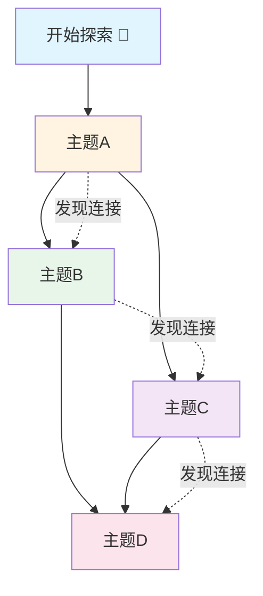

# 探索地图

## 说明

这是你的探索地图，用地图的形式展示你的探索历程。你可以看到自己探索过的主题、发现的重要节点，以及知识之间的连接路径。

---

## 探索旅程

### 探索起点

🎯 **开始探索** - YYYY-MM-DD

---

## 探索路径

### 路径1：主题A的探索

```
开始 → 主题A → 发现1 → 发现2 → 连接主题B
```

**探索时间**：YYYY-MM-DD  
**重要发现**：
- 发现1：...
- 发现2：...

**知识连接**：
- 连接到主题B

---

### 路径2：主题B的探索

```
开始 → 主题B → 发现1 → 发现2 → 连接主题C
```

**探索时间**：YYYY-MM-DD  
**重要发现**：
- 发现1：...
- 发现2：...

**知识连接**：
- 连接到主题C

---

## 重要发现标记

### 🏆 重要发现1

- **发现时间**：YYYY-MM-DD
- **发现内容**：...
- **意义**：...

### 🏆 重要发现2

- **发现时间**：YYYY-MM-DD
- **发现内容**：...
- **意义**：...

---

## 探索里程碑

### 🎉 第一次探索

- **时间**：YYYY-MM-DD
- **主题**：...
- **意义**：开始探索之旅

### ⭐ 第10次探索

- **时间**：YYYY-MM-DD
- **主题**：...
- **意义**：探索达人

---

## 知识连接路径

### 连接路径1：主题A ↔ 主题B

```
主题A → [连接点] → 主题B
```

**连接说明**：...

### 连接路径2：主题B ↔ 主题C

```
主题B → [连接点] → 主题C
```

**连接说明**：...

---

## 探索地图可视化



---

## 探索统计

### 探索概况

- **总探索次数**：0
- **探索主题数**：0
- **重要发现数**：0
- **知识连接数**：0
- **探索路径数**：0

### 探索领域分布

| 领域 | 探索次数 | 重要发现 |
|------|----------|----------|
| 科学 | 0 | 0 |
| 艺术 | 0 | 0 |
| 生活 | 0 | 0 |
| 技术 | 0 | 0 |
| 其他 | 0 | 0 |

---

## 探索时间线

### YYYY年MM月

- **YYYY-MM-DD**：开始探索主题A
- **YYYY-MM-DD**：发现主题A和主题B的连接
- **YYYY-MM-DD**：完成主题A的探索

---

## 使用说明

### 如何查看探索地图

1. 查看"探索路径"了解探索的历程
2. 查看"重要发现标记"了解重要发现
3. 查看"探索里程碑"了解重要节点
4. 查看"知识连接路径"了解知识之间的连接
5. 查看"探索地图可视化"用图表形式查看探索网络

### 探索地图的意义

- **展示探索历程**：让你看到自己探索过的主题和路径
- **发现知识连接**：帮助你发现知识之间的关联
- **激发新探索**：基于已有探索发现新的探索方向
- **形成正闭环**：帮助你形成正闭环学习体验

---

## 备注

（记录其他重要信息）
