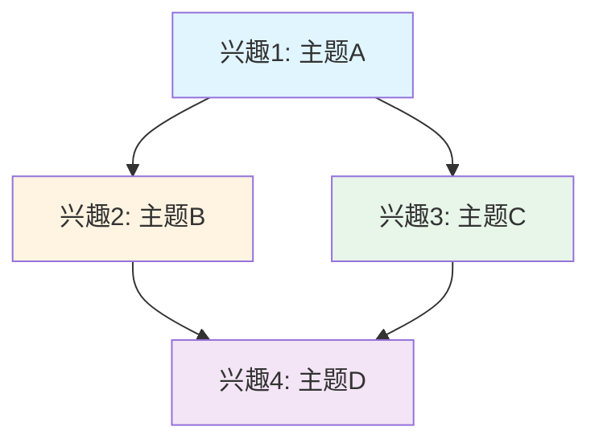

# 兴趣追踪

## 说明

这个文件记录你的所有兴趣点，追踪兴趣的演变，发现兴趣模式，帮助你了解自己的好奇心走向。

---

## 兴趣列表

（按发现时间排序，最新的在最前面）

### 兴趣I001：[兴趣主题]

- **发现时间**：YYYY-MM-DD
- **触发问题**：（记录是什么问题引发了兴趣）
- **兴趣强度**：强烈 / 一般 / 偶尔
- **当前状态**：活跃 / 暂停 / 已完成
- **探索次数**：N
- **相关探索**：
  - [探索记录1](explorer/explorations/YYYYMMDD-HHMMSS-topic.md)
  - [探索记录2](explorer/explorations/YYYYMMDD-HHMMSS-topic.md)
- **兴趣演变**：
  - YYYY-MM-DD：初次发现，问题："..."
  - YYYY-MM-DD：第一次探索，了解了...
  - YYYY-MM-DD：深入探索，发现了...
- **深化方向**：
  （记录可以进一步探索的方向）
  1. 
  2. 
  3. 
- **相关兴趣**：[兴趣ID列表]
- **知识节点**：[节点ID列表]

---

## 兴趣演变追踪

### 演变模式1：从浅到深
（某个兴趣从简单问题逐步深入）

**兴趣I001：XX主题**
- 阶段1（YYYY-MM-DD）：简单问题"为什么..."
- 阶段2（YYYY-MM-DD）：深入理解"如何..."
- 阶段3（YYYY-MM-DD）：应用探索"可以用于..."

### 演变模式2：兴趣分支
（一个兴趣引发多个相关兴趣）

**兴趣I001：XX主题**
- 分支1：兴趣I002（相关主题）
- 分支2：兴趣I003（应用场景）

### 演变模式3：兴趣融合
（多个兴趣融合形成新兴趣）

**兴趣I001 + 兴趣I002 → 兴趣I004**

---

## 兴趣模式分析

### 最活跃的兴趣
（探索次数最多的兴趣）

1. **兴趣I001**：探索N次
   - 主要方向：...
   - 特点：...

### 最持久的兴趣
（持续时间最长的兴趣）

1. **兴趣I001**：持续N天
   - 演变过程：...
   - 深化程度：...

### 兴趣领域分布
（按领域分类的兴趣）

- **领域A**：兴趣I001, I002, I003
- **领域B**：兴趣I004, I005
- **跨领域**：兴趣I006（连接领域A和B）

### 兴趣强度变化
（追踪兴趣强度的变化）

| 兴趣ID | 初始强度 | 当前强度 | 变化趋势 |
|--------|----------|----------|----------|
| I001   | 一般     | 强烈     | 上升     |

---

## 兴趣连接网络

---

## 兴趣建议

### 可以深化的兴趣
（基于当前探索，建议可以进一步深化的兴趣）

1. **兴趣I001**
   - 当前状态：已探索基础内容
   - 深化建议：...
   - 优先级：高 / 中 / 低

### 可以重新激活的兴趣
（之前暂停但可以重新探索的兴趣）

1. **兴趣I002**
   - 暂停原因：...
   - 重新激活建议：...
   - 相关新发现：...

### 可以探索的新方向
（基于现有兴趣，建议探索的新方向）

1. **方向1**
   - 与现有兴趣的关系：...
   - 探索建议：...
   - 预期收获：...

---

## 兴趣统计

- **总兴趣数**：0
- **活跃兴趣**：0
- **已完成兴趣**：0
- **暂停兴趣**：0
- **最活跃领域**：（领域名称）
- **平均兴趣持续时间**：N天
- **兴趣转化率**：N%（从兴趣到深度探索的比例）

---

## 兴趣时间线

### YYYY年MM月

- **YYYY-MM-DD**：发现兴趣I001（主题A）
- **YYYY-MM-DD**：兴趣I001深化，引发兴趣I002
- **YYYY-MM-DD**：兴趣I003和I004融合

---

## 使用说明

### 如何识别新兴趣

AI会在以下情况识别新兴趣：
1. 用户提出新的问题
2. 探索过程中产生新的疑问
3. 发现新的探索方向
4. 跨领域连接产生新兴趣

### 如何追踪兴趣演变

1. 查看"兴趣演变追踪"部分了解兴趣的发展过程
2. 查看"兴趣模式分析"了解兴趣的特点
3. 查看"兴趣连接网络"了解兴趣之间的关系

### 如何利用兴趣建议

1. 查看"可以深化的兴趣"继续深入探索
2. 查看"可以重新激活的兴趣"重新开始探索
3. 查看"可以探索的新方向"发现新的兴趣点

---

## 备注

（记录其他重要信息）
