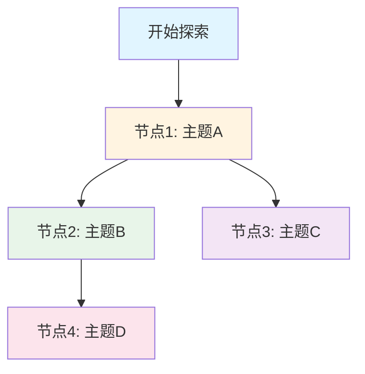

# 知识图谱

## 图谱说明

这是你的知识探索图谱，记录了所有探索过的主题、概念和它们之间的关联。知识图谱会随着你的探索自动更新，帮助你发现知识之间的连接，形成知识网络。

---

## 知识节点

（以下节点按创建时间排序，最新的在最前面）

### 节点索引

| 节点ID | 主题 | 创建时间 | 探索次数 | 相关节点数 | 能力标签 |
|--------|------|----------|----------|------------|----------|
| N001   |      |          |          |            |          |

---

## 节点详情

### 节点N001：[主题名称]

- **创建时间**：YYYY-MM-DD
- **最后更新**：YYYY-MM-DD
- **探索次数**：N
- **探索记录**：
  - [探索记录1](explorer/explorations/YYYYMMDD-HHMMSS-topic.md)
  - [探索记录2](explorer/explorations/YYYYMMDD-HHMMSS-topic.md)
- **相关节点**：[节点ID1, 节点ID2, ...]
- **能力标签**：[观察力, 逻辑思维, 创造力, ...]
- **节点描述**：
  （简要描述这个节点的核心内容）

---

## 连接关系

（记录节点之间的关联关系）

### 关系类型说明

- **引发**：节点A引发了节点B的探索
- **相关**：节点A和节点B在概念上相关
- **应用**：节点A的知识可以应用到节点B
- **深化**：节点B是对节点A的深入探索
- **对比**：节点A和节点B形成对比关系
- **组合**：节点A和节点B可以组合形成新知识

### 连接列表

| 源节点 | 关系类型 | 目标节点 | 连接说明 | 创建时间 |
|--------|----------|----------|----------|----------|
| N001   | 引发     | N002     |          | YYYY-MM-DD |

---

## 知识网络可视化

（此图表会根据实际节点和连接自动更新）

---

## 知识领域分类

### 领域1：[领域名称]
- 节点：[节点ID列表]
- 探索次数：N
- 主要能力：观察力、逻辑思维

### 领域2：[领域名称]
- 节点：[节点ID列表]
- 探索次数：N
- 主要能力：创造力、问题解决

---

## 知识统计

- **总节点数**：0
- **总连接数**：0
- **最活跃节点**：（节点ID，探索次数）
- **最活跃领域**：（领域名称，节点数）
- **知识网络密度**：低/中/高

---

## 更新日志

- YYYY-MM-DD：创建知识图谱
- YYYY-MM-DD：添加节点N001
- YYYY-MM-DD：添加连接 N001 → N002

---

## 使用说明

### 如何添加新节点

当进行新的探索时，AI会自动：
1. 识别探索主题
2. 创建新节点或更新已有节点
3. 发现与已有节点的连接
4. 更新知识图谱

### 如何查看知识网络

1. 查看"知识网络可视化"部分的Mermaid图表
2. 查看"连接关系"部分了解节点间的关联
3. 查看"知识领域分类"了解知识分布

### 如何发现新探索方向

1. 查看"可以继续探索的方向"（在探索记录中）
2. 查看知识图谱中的"孤立节点"（没有连接的节点）
3. 查看不同领域之间的空白，寻找跨领域连接

---

## 备注

（记录其他重要信息）
