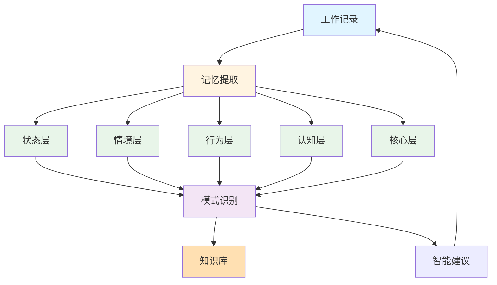

# AI as me 教师工作空间

## 系统介绍

AI as me 教师工作空间是一个多层次的智能工作伙伴系统，专为物流货代专业老师设计，支持教学、科研、产研实践、职业比赛等全方位工作场景，通过多层次记忆架构实现AI赋能教学和科研成果产出。

### 核心理念

- **多层次记忆**：在状态层、情境层、行为层、认知层、核心层逐步建立记忆
- **工作闭环**：问题→分析→解决→总结→模式提取→优化→新问题
- **知识沉淀**：将教学、科研、实践经验转化为可复用的知识库和工作模式
- **认知融合**：在思维模式、决策框架、价值观等层面深度协作
- **AI as me**：最终实现"相辅相成，融为一体"的目标

### 与功能安全工作平台的区别

| 特性 | ai-as-me-workplace | ai-as-me-teacher-workplace |
|------|-------------------|---------------------------|
| 用途 | 技术工作、团队管理 | 教学、科研、产研实践 |
| 用户 | 功能安全专家 | 物流货代专业老师 |
| 重点 | 技术分析、文档协作 | 教学、科研、产研、比赛 |
| 记忆架构 | 多层次记忆架构 | 多层次记忆架构 |
| 适用场景 | 工作、管理、决策 | 教学、科研、产研、比赛 |

**两者独立运行**：功能安全工作平台用于技术工作，教师工作平台用于教学科研工作。

---

## 快速开始

### 1. 打开系统

在Cursor中打开本项目目录：
```
study-systems/ai-as-me-teacher-workplace/
```

### 2. 开始工作

直接在Cursor聊天窗口输入你的工作需求，例如：
- "如何设计物流货代实践课程？"
- "我需要申报一个物流货代相关的课题"
- "我想与企业合作开展实践项目"
- "我要指导学生参加物流货代职业比赛"

AI会基于你的背景、知识库和记忆提供专业支持。

### 3. 查看记录

你的工作会自动记录在：
- `teaching/` - 教学记录（课程、教案、教学材料、评估、学生互动）
- `research/` - 科研记录（项目、论文、课题、协作）
- `industry/` - 产研记录（校企合作、实践项目、案例）
- `competitions/` - 比赛记录（比赛、培训、成果）
- `knowledge/` - 知识库（物流货代知识、教学法、科研方法、工作模式）
- `memory/` - 记忆架构（状态、情境、行为、认知、核心层）
- `insights/` - 洞察和总结（周度洞察、月度回顾、成长追踪）
- `profile/` - 工作画像（工作画像、专业能力地图、教学风格）
- `capabilities/` - AI能力（Skill、Agent、MCP、本地工具）

---

## 系统功能

### 1. 教学协作

#### 课程管理
- 课程设计、进度跟踪、效果评估
- 课程记录：`teaching/courses/courses/`

#### 教案管理
- 教案编写、优化、版本管理
- 教案记录：`teaching/lessons/lessons/`

#### 教学材料
- 教学材料准备、更新、共享
- 教学材料记录：`teaching/materials/materials/`

#### 评估与反馈
- 学生评估、反馈收集、效果分析
- 评估记录：`teaching/assessments/assessments/`

#### 学生互动
- 学生互动记录、问题跟踪、反馈处理
- 互动记录：`teaching/student-interactions/interactions/`

### 2. 科研协作

#### 科研项目
- 项目规划、进度跟踪、成果管理
- 项目记录：`research/projects/projects/`

#### 论文管理
- 论文写作、投稿、发表跟踪
- 论文记录：`research/papers/papers/`

#### 课题管理
- 课题申报、研究执行、结题管理
- 课题记录：`research/topics/topics/`

#### 科研协作
- 协作记录、沟通要点、成果跟踪
- 协作记录：`research/collaborations/collaborations/`

### 3. 产研实践

#### 校企合作
- 合作规划、协议管理、成果跟踪
- 合作记录：`industry/partnerships/partnerships/`

#### 实践项目
- 项目设计、执行跟踪、成果转化
- 实践记录：`industry/practices/practices/`

#### 案例库
- 案例收集、整理、应用
- 案例记录：`industry/cases/cases/`

### 4. 职业比赛

#### 比赛记录
- 比赛准备、过程跟踪、成果总结
- 比赛记录：`competitions/competitions/competitions/`

#### 培训记录
- 培训计划、执行跟踪、效果评估
- 培训记录：`competitions/training/training/`

#### 成果记录
- 成果收集、整理、应用
- 成果记录：`competitions/achievements/achievements/`

### 5. 知识库系统

#### 物流货代知识
- 基础知识、实践知识、法规标准
- 知识库：`knowledge/logistics/`

#### 教学法知识
- 教学方法、AI赋能教学、最佳实践
- 知识库：`knowledge/pedagogy/`

#### 科研知识
- 研究方法、论文写作、课题申报
- 知识库：`knowledge/research/`

#### 工作模式
- 教学模式、科研模式、协作模式
- 工作模式：`knowledge/patterns/`

### 6. 多层次记忆架构（核心）

#### 状态层（State Layer）
- 记录当前工作状态（教学、科研、产研、比赛）
- 追踪状态变化历史
- 识别状态模式（教学创新期、科研攻关期、产研合作期、比赛准备期）
- 文件：`memory/state/`

#### 情境层（Context Layer）
- 记录工作情境（教学情境、科研情境、产研情境、比赛情境）
- 识别情境模式（教学创新期、科研攻关期、产研合作期、比赛准备期）
- 建立情境-行为关联
- 文件：`memory/context/`

#### 行为层（Behavior Layer）
- 记录具体行动（教学行为、科研行为、决策、沟通）
- 分析行为有效性
- 识别高效行为模式
- 文件：`memory/behavior/`

#### 认知层（Cognition Layer）
- **思维模式**：系统思维、创新思维、实践思维等
- **决策框架**：教学决策框架、科研决策框架、产研决策框架等
- **认知偏好**：偏好实践、偏好创新、偏好数据驱动等
- **推理轨迹**：重要决策的推理过程
- 文件：`memory/cognition/`

#### 核心层（Core Layer）
- **价值观**：教育使命、专业精神、持续改进等
- **性格特征**：严谨、创新、耐心、领导力等
- **核心原则**：提炼的核心工作原则
- **演变记录**：核心层的演变过程
- 文件：`memory/core/`

### 7. 洞察与总结

#### 周度洞察
- 每周自动总结工作亮点、问题、模式
- 文件：`insights/weekly-insights.md`

#### 月度回顾
- 深度回顾、成长分析、模式发现
- 文件：`insights/monthly-review.md`

#### 成长追踪
- 能力提升、知识积累、认知演进
- 文件：`insights/growth-tracker.md`

#### 模式发现
- 自动发现工作模式、决策模式、行为模式
- 文件：`insights/pattern-discovery.md`

### 8. AI能力扩展架构

#### 能力类型
- **Skill能力**：单一功能的AI能力（如文档分析、代码生成等）
- **Agent能力**：具有自主决策能力的AI代理
- **MCP能力**：通过MCP协议集成的外部服务
- **本地工具**：封装为Skill的本地工具

#### 能力注册
- 所有能力需要在`capabilities/registry.md`注册
- 使用标准模板创建能力定义
- 支持能力版本管理和状态管理

#### 能力调用
- 根据用户请求自动选择合适的能力
- 支持能力组合和调用链
- 记录所有能力使用情况

#### 能力管理
- 使用记录：`capabilities/usage/usage-history.md`
- 效果分析：`capabilities/usage/effectiveness.md`
- 能力知识库：`knowledge/capabilities/`
- 能力记忆：`memory/capabilities/`

---

## 使用场景示例

### 场景1：课程设计

**用户**："如何设计物流货代实践课程？"

**AI回应**：
"这是一个典型的实践课程设计问题。基于项目教学法和物流货代实践，我建议：

1. 课程目标设计（实践能力、职业素养）
2. 实践项目选择（真实案例、校企合作）
3. 教学方法选择（项目教学、案例教学、翻转课堂）
4. 评估方式设计（过程评估、成果评估、能力评估）

基于你之前的教学经验，我注意到你在XX课程中采用了...
这次是否需要考虑不同的约束？"

**结果**：
- 创建课程设计记录
- 更新知识库（教学法相关）
- 记录推理轨迹（认知层）
- 提取工作模式（如果形成新模式）

### 场景2：课题申报

**用户**："我需要申报一个物流货代相关的课题"

**AI回应**：
"好的，让我先了解一下课题类型和背景...

基于课题申报要求，我建议：
1. 研究主题选择（结合物流货代发展趋势）
2. 研究问题设计（理论问题、实践问题）
3. 研究方法选择（定量、定性、混合研究）
4. 研究计划制定（时间安排、资源需求）
5. 预期成果设计（论文、实践应用、人才培养）

我注意到你在之前的课题中特别关注...
这次是否需要调整？"

**结果**：
- 创建课题申报记录
- 更新科研知识库
- 记录申报决策（行为层）
- 更新课题申报模式

### 场景3：校企合作

**用户**："我想与企业合作开展实践项目"

**AI回应**：
"基于产研实践经验，我建议：
1. 合作企业选择（行业地位、合作意愿、资源匹配）
2. 合作模式设计（实习基地、项目合作、人才培养）
3. 实践项目设计（真实项目、能力培养、成果产出）
4. 合作机制建立（沟通机制、管理机制、评估机制）

需要注意：
- 企业需求与教学目标的平衡
- 学生能力与企业要求的匹配
- 实践成果的转化与应用"

**结果**：
- 记录校企合作准备
- 更新产研实践模式
- 记录合作策略（行为层）

### 场景4：比赛指导

**用户**："我要指导学生参加物流货代职业比赛"

**AI回应**：
"基于比赛指导经验，我建议：
1. 比赛分析（比赛规则、评分标准、往届经验）
2. 学生选拔（能力评估、团队组建）
3. 培训计划（知识培训、技能培训、模拟训练）
4. 比赛策略（时间管理、团队协作、应变能力）
5. 成果总结（经验提炼、模式总结、知识沉淀）

需要注意：
- 比赛要求与教学目标的结合
- 学生能力与比赛要求的匹配
- 比赛成果的转化与应用"

**结果**：
- 记录比赛指导准备
- 更新比赛指导模式
- 记录培训策略（行为层）

---

## 多层次记忆架构说明

### 记忆架构层次



### 记忆提取机制

#### 从工作记录中提取
- **状态层**：从课程、科研项目、产研项目、比赛记录中提取当前状态
- **情境层**：从项目背景、教学情境、科研情境中提取情境
- **行为层**：从决策、沟通记录中提取行为
- **认知层**：从决策推理、问题分析中提取认知
- **核心层**：从价值观表达、原则提炼中提取核心

#### 模式识别
- 从各层记忆中识别模式
- 建立模式之间的关联
- 形成工作模式库

#### 智能建议
- 基于记忆和模式提供个性化建议
- 考虑状态、情境、行为、认知、核心层
- 形成闭环优化

---

## 文件结构

```
ai-as-me-teacher-workplace/
├── CURSOR.md                    # AI as me 核心指令文件（教师版）
├── README.md                    # 系统说明文档（本文件）
│
├── teaching/                    # 教学协作目录
│   ├── courses/                 # 课程管理
│   │   ├── COURSE-TEMPLATE.md
│   │   └── courses/             # 具体课程记录
│   ├── lessons/                 # 教案管理
│   │   ├── LESSON-TEMPLATE.md
│   │   └── lessons/             # 具体教案记录
│   ├── materials/               # 教学材料
│   │   ├── MATERIAL-TEMPLATE.md
│   │   └── materials/           # 具体教学材料
│   ├── assessments/             # 评估与反馈
│   │   ├── ASSESSMENT-TEMPLATE.md
│   │   └── assessments/         # 具体评估记录
│   └── student-interactions/    # 学生互动
│       ├── INTERACTION-TEMPLATE.md
│       └── interactions/         # 具体互动记录
│
├── research/                    # 科研协作目录
│   ├── projects/                # 科研项目
│   │   ├── PROJECT-TEMPLATE.md
│   │   └── projects/            # 具体项目记录
│   ├── papers/                  # 论文管理
│   │   ├── PAPER-TEMPLATE.md
│   │   └── papers/              # 具体论文记录
│   ├── topics/                  # 课题管理
│   │   ├── TOPIC-TEMPLATE.md
│   │   └── topics/              # 具体课题记录
│   └── collaborations/          # 科研协作
│       ├── COLLABORATION-TEMPLATE.md
│       └── collaborations/     # 具体协作记录
│
├── industry/                    # 产研实践目录
│   ├── partnerships/            # 校企合作
│   │   ├── PARTNERSHIP-TEMPLATE.md
│   │   └── partnerships/        # 具体合作记录
│   ├── practices/               # 实践项目
│   │   ├── PRACTICE-TEMPLATE.md
│   │   └── practices/           # 具体实践记录
│   └── cases/                   # 案例库
│       ├── CASE-TEMPLATE.md
│       └── cases/                # 具体案例记录
│
├── competitions/                # 职业比赛目录
│   ├── competitions/            # 比赛记录
│   │   ├── COMPETITION-TEMPLATE.md
│   │   └── competitions/        # 具体比赛记录
│   ├── training/                # 培训记录
│   │   ├── TRAINING-TEMPLATE.md
│   │   └── training/            # 具体培训记录
│   └── achievements/            # 成果记录
│       └── achievements/         # 具体成果记录
│
├── knowledge/                   # 知识库目录
│   ├── knowledge-base.md        # 知识库索引
│   ├── logistics/               # 物流货代知识
│   │   ├── fundamentals/        # 基础知识
│   │   ├── practices/           # 实践知识
│   │   └── regulations/         # 法规标准
│   ├── pedagogy/                # 教学法知识
│   │   ├── methods/             # 教学方法
│   │   ├── ai-empowerment/      # AI赋能教学
│   │   └── best-practices/      # 最佳实践
│   ├── research/                # 科研知识
│   │   ├── methodologies/       # 研究方法
│   │   ├── writing/             # 论文写作
│   │   └── funding/            # 课题申报
│   └── patterns/                # 工作模式库
│       ├── teaching/            # 教学模式
│       ├── research/            # 科研模式
│       └── collaboration/      # 协作模式
│
├── memory/                      # 记忆架构目录（核心）
│   ├── state/                   # 状态层
│   │   ├── current-state.md    # 当前状态
│   │   └── state-history.md    # 状态历史
│   ├── context/                 # 情境层
│   │   ├── teaching-contexts/  # 教学情境
│   │   ├── research-contexts/  # 科研情境
│   │   └── context-patterns.md # 情境模式
│   ├── behavior/                # 行为层
│   │   ├── behavior-patterns.md # 行为模式
│   │   ├── action-history.md   # 行动历史
│   │   └── effectiveness.md    # 行为有效性分析
│   ├── cognition/               # 认知层
│   │   ├── thinking-models.md  # 思维模式
│   │   ├── decision-frameworks.md # 决策框架
│   │   ├── cognitive-preferences.md # 认知偏好
│   │   └── reasoning-traces.md # 推理轨迹
│   └── core/                    # 核心层
│       ├── values.md            # 价值观
│       ├── personality.md       # 性格特征
│       ├── principles.md        # 核心原则
│       └── evolution.md         # 核心层演变记录
│
├── insights/                    # 洞察和总结
│   ├── weekly-insights.md       # 周度洞察
│   ├── monthly-review.md        # 月度回顾
│   ├── growth-tracker.md        # 成长追踪
│   └── pattern-discovery.md     # 模式发现
│
├── profile/                     # 工作画像
│   ├── work-profile.md          # 工作画像（角色、职责、能力）
│   ├── expertise-map.md         # 专业能力地图
│   └── teaching-style.md        # 教学风格
│
└── capabilities/                # AI能力目录
    ├── registry.md              # 能力注册表
    ├── capabilities-index.md    # 能力索引
    ├── skills/                  # Skill能力
    │   ├── SKILL-TEMPLATE.md    # Skill模板
    │   └── skills/              # 具体Skill
    ├── agents/                  # Agent能力
    │   ├── AGENT-TEMPLATE.md    # Agent模板
    │   └── agents/              # 具体Agent
    ├── mcps/                    # MCP能力
    │   ├── MCP-TEMPLATE.md     # MCP模板
    │   └── mcps/                # 具体MCP
    └── usage/                   # 使用记录
        ├── usage-history.md     # 使用历史
        └── effectiveness.md     # 使用效果分析
```

---

## 使用技巧

### 1. 如何开始工作

- **直接提问**：有任何工作问题都可以问
- **描述需求**：说"我需要..."或"帮我..."
- **分享情境**：分享工作情境，AI会基于记忆提供建议

### 2. 如何形成闭环

- **问题提出**：提出工作问题或需求
- **专业分析**：AI基于知识库和记忆提供分析
- **执行记录**：记录执行过程和结果
- **总结优化**：总结工作，提取模式，优化工作方式
- **新问题产生**：基于总结产生新的优化方向

### 3. 如何查看记录

- **教学记录**：查看`teaching/`目录了解具体教学
- **科研记录**：查看`research/`目录了解科研情况
- **产研记录**：查看`industry/`目录了解产研实践
- **比赛记录**：查看`competitions/`目录了解比赛情况
- **知识库**：查看`knowledge/`目录了解知识积累
- **记忆架构**：查看`memory/`目录了解多层次记忆
- **洞察总结**：查看`insights/`目录了解工作洞察

### 4. 如何积累知识

- **主动记录**：重要工作主动记录
- **模式提取**：从工作中提取工作模式
- **经验沉淀**：将经验转化为知识库条目
- **持续优化**：基于反馈优化知识库

---

## 常见问题

### Q1: 这个系统和功能安全工作平台有什么区别？

**A**: 功能安全工作平台用于技术工作（功能安全专家），教师工作平台用于教学科研工作（物流货代专业老师）。两者独立运行，互不干扰。

### Q2: 我需要手动记录所有工作吗？

**A**: 不需要！AI会自动记录重要工作。你只需要自然地和AI协作，提出工作需求。

### Q3: 多层次记忆架构是如何工作的？

**A**: AI会从你的工作记录中自动提取各层记忆：
- **状态层**：当前工作状态
- **情境层**：工作情境
- **行为层**：具体行动
- **认知层**：思维模式、决策框架
- **核心层**：价值观、性格特征

### Q4: 如何查看我的工作模式？

**A**: 查看`insights/pattern-discovery.md`了解发现的工作模式，或查看`knowledge/patterns/`了解工作模式库。

### Q5: 如何形成工作闭环？

**A**: 从问题开始，专业分析，执行记录，总结优化，提取模式，继续优化。AI会在适当时机引导你形成闭环。

### Q6: 如何使用AI能力（Skill、Agent、MCP）？

**A**: 直接描述需求即可，AI会自动从能力注册表中选择合适的能力。你也可以注册新能力或封装本地工具为Skill。

---

## 系统特点

### 1. 专业精准

- 基于物流货代专业知识提供准确建议
- 熟悉教学法、科研方法、产研实践方法
- 了解行业法规标准、实践案例、常见问题

### 2. 场景化应对

- 针对教师角色提供实用建议
- 协助输出教学文档或评估方案
- 帮助分析具体教学、科研、产研、比赛问题

### 3. 多层次记忆

- 在状态、情境、行为、认知、核心层建立记忆
- 逐步形成完整的认知模型
- 实现深度协作与融合

### 4. 闭环优化

- 从工作中学习，优化工作模式
- 持续改进工作方式和决策框架
- 形成正闭环迭代

---

## 技术说明

### AI模型支持

这个系统设计为**模型无关**的架构，可以与多种大语言模型配合使用：

#### 在Cursor中使用
- **Cursor AI助手**：系统默认使用Cursor内置的AI助手（Auto）
- **模型选择**：Cursor支持多种模型，包括但不限于：
  - Claude系列（Anthropic）
  - GPT系列（OpenAI）
  - 其他兼容的大语言模型

#### 系统设计理念
- **模型无关**：系统的核心是交互逻辑和记录机制，不依赖特定模型
- **指令驱动**：通过`CURSOR.md`中的指令定义AI行为，适配不同模型
- **可扩展性**：理论上可以与任何支持指令遵循的大语言模型配合使用

### 系统架构
- **文件系统**：基于Markdown文件的轻量级存储
- **知识图谱**：使用Mermaid图表进行可视化
- **自动记录**：通过AI的文件操作能力自动维护记录

### 技术特点
- **无需数据库**：所有数据存储在Markdown文件中
- **版本控制友好**：所有文件都是文本格式，易于Git管理
- **跨平台**：可在任何支持Cursor的平台上使用

---

## 开始使用

现在就打开Cursor，开始你的教师工作协作之旅吧！

**记住**：
- 任何工作问题都可以问
- AI会基于你的背景和记忆提供专业支持
- 工作会自动记录，知识会持续沉淀
- 多层次记忆会逐步建立，最终实现深度融合

祝你工作顺利，持续成长！
