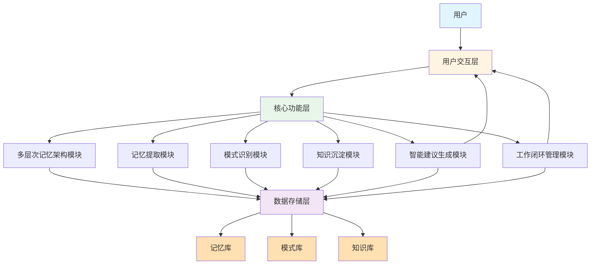
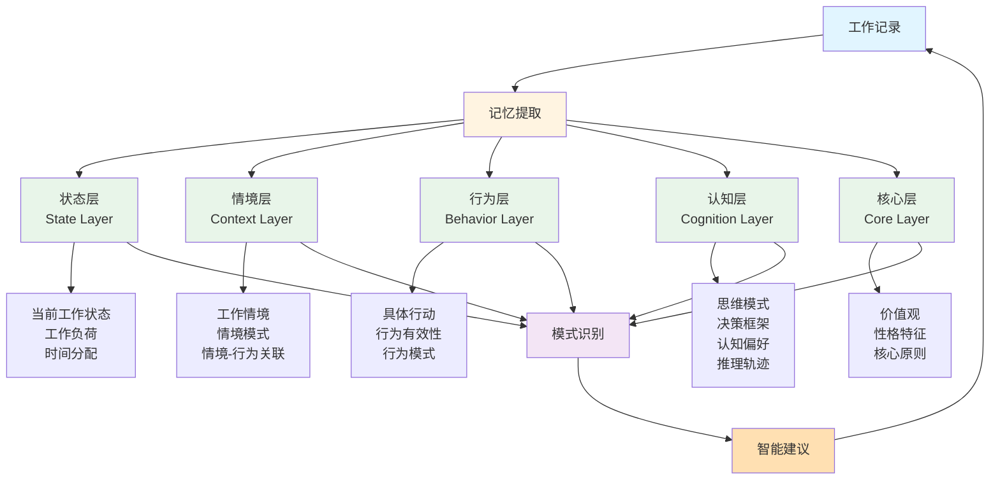
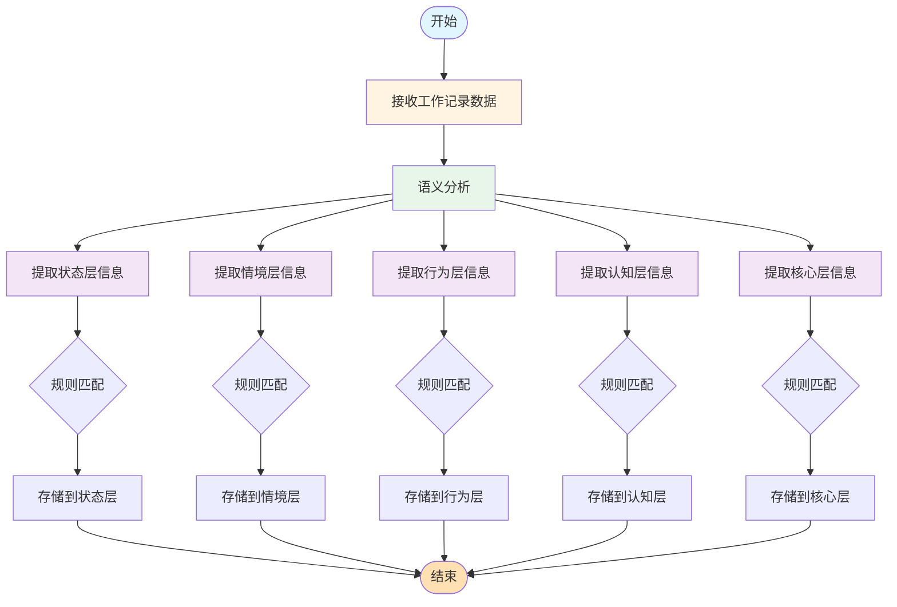
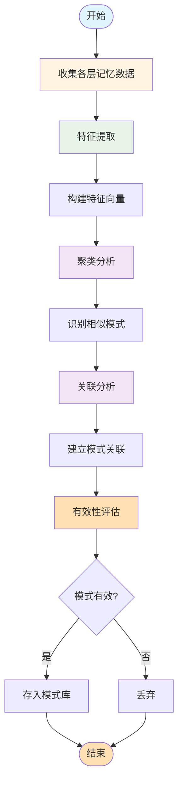
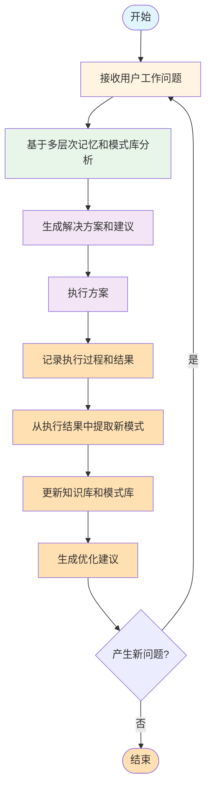
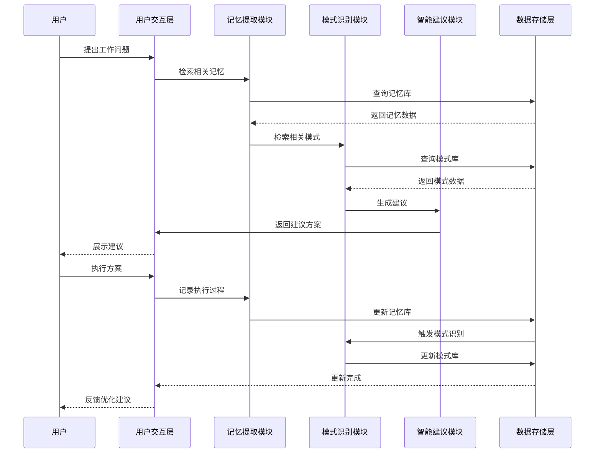
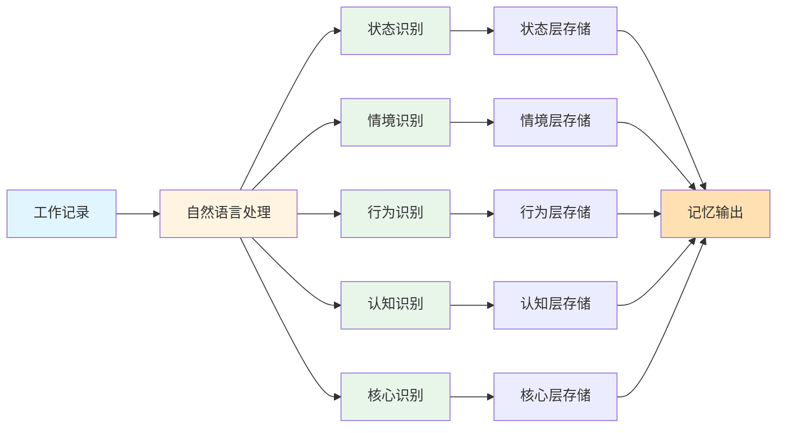
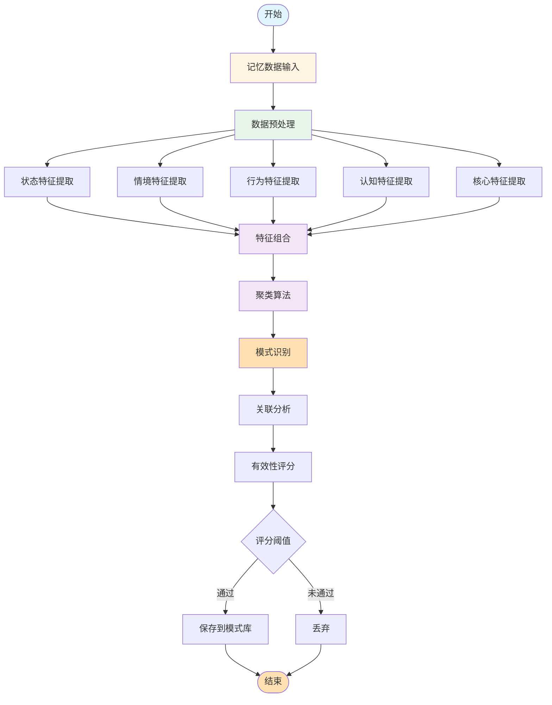

# 说明书附图（Mermaid图表）

## 图1：系统整体架构图

```mermaid
flowchart TB
    User[用户] --> UI[用户交互层]
    UI --> Core[核心功能层]
    
    Core --> M1[多层次记忆架构模块]
    Core --> M2[记忆提取模块]
    Core --> M3[模式识别模块]
    Core --> M4[知识沉淀模块]
    Core --> M5[智能建议生成模块]
    Core --> M6[工作闭环管理模块]
    
    M1 --> Storage[数据存储层]
    M2 --> Storage
    M3 --> Storage
    M4 --> Storage
    M5 --> Storage
    M6 --> Storage
    
    Storage --> Memory[记忆库]
    Storage --> Pattern[模式库]
    Storage --> Knowledge[知识库]
    
    M5 --> UI
    M6 --> UI
    
    style User fill:#e1f5ff
    style UI fill:#fff4e1
    style Core fill:#e8f5e9
    style Storage fill:#f3e5f5
    style Memory fill:#ffe0b2
    style Pattern fill:#ffe0b2
    style Knowledge fill:#ffe0b2
```

## 图2：多层次记忆架构图

```mermaid
flowchart TD
    WorkRecord[工作记录] --> Extract[记忆提取]
    
    Extract --> Layer1[状态层<br/>State Layer]
    Extract --> Layer2[情境层<br/>Context Layer]
    Extract --> Layer3[行为层<br/>Behavior Layer]
    Extract --> Layer4[认知层<br/>Cognition Layer]
    Extract --> Layer5[核心层<br/>Core Layer]
    
    Layer1 --> Content1["当前工作状态<br/>工作负荷<br/>时间分配"]
    Layer2 --> Content2["工作情境<br/>情境模式<br/>情境-行为关联"]
    Layer3 --> Content3["具体行动<br/>行为有效性<br/>行为模式"]
    Layer4 --> Content4["思维模式<br/>决策框架<br/>认知偏好<br/>推理轨迹"]
    Layer5 --> Content5["价值观<br/>性格特征<br/>核心原则"]
    
    Layer1 --> Pattern[模式识别]
    Layer2 --> Pattern
    Layer3 --> Pattern
    Layer4 --> Pattern
    Layer5 --> Pattern
    
    Pattern --> Suggest[智能建议]
    Suggest --> WorkRecord
    
    style WorkRecord fill:#e1f5ff
    style Extract fill:#fff4e1
    style Layer1 fill:#e8f5e9
    style Layer2 fill:#e8f5e9
    style Layer3 fill:#e8f5e9
    style Layer4 fill:#e8f5e9
    style Layer5 fill:#e8f5e9
    style Pattern fill:#f3e5f5
    style Suggest fill:#ffe0b2
```

## 图3：记忆提取流程图

```mermaid
flowchart TD
    Start([开始]) --> Input[接收工作记录数据]
    Input --> Analyze[语义分析]
    
    Analyze --> Extract1[提取状态层信息]
    Analyze --> Extract2[提取情境层信息]
    Analyze --> Extract3[提取行为层信息]
    Analyze --> Extract4[提取认知层信息]
    Analyze --> Extract5[提取核心层信息]
    
    Extract1 --> Rule1{规则匹配}
    Extract2 --> Rule2{规则匹配}
    Extract3 --> Rule3{规则匹配}
    Extract4 --> Rule4{规则匹配}
    Extract5 --> Rule5{规则匹配}
    
    Rule1 --> Store1[存储到状态层]
    Rule2 --> Store2[存储到情境层]
    Rule3 --> Store3[存储到行为层]
    Rule4 --> Store4[存储到认知层]
    Rule5 --> Store5[存储到核心层]
    
    Store1 --> End([结束])
    Store2 --> End
    Store3 --> End
    Store4 --> End
    Store5 --> End
    
    style Start fill:#e1f5ff
    style Input fill:#fff4e1
    style Analyze fill:#e8f5e9
    style Extract1 fill:#f3e5f5
    style Extract2 fill:#f3e5f5
    style Extract3 fill:#f3e5f5
    style Extract4 fill:#f3e5f5
    style Extract5 fill:#f3e5f5
    style End fill:#ffe0b2
```

## 图4：模式识别流程图

```mermaid
flowchart TD
    Start([开始]) --> Collect[收集各层记忆数据]
    Collect --> Feature[特征提取]
    
    Feature --> Vector[构建特征向量]
    Vector --> Cluster[聚类分析]
    
    Cluster --> Similar[识别相似模式]
    Similar --> Associate[关联分析]
    
    Associate --> Relate[建立模式关联]
    Relate --> Evaluate[有效性评估]
    
    Evaluate --> Valid{模式有效?}
    Valid -->|是| Store[存入模式库]
    Valid -->|否| Discard[丢弃]
    
    Store --> End([结束])
    Discard --> End
    
    style Start fill:#e1f5ff
    style Collect fill:#fff4e1
    style Feature fill:#e8f5e9
    style Cluster fill:#f3e5f5
    style Associate fill:#f3e5f5
    style Evaluate fill:#ffe0b2
    style End fill:#ffe0b2
```

## 图5：工作闭环流程图

```mermaid
flowchart TD
    Start([开始]) --> Problem[接收用户工作问题]
    Problem --> Analyze[基于多层次记忆和模式库分析]
    
    Analyze --> Solution[生成解决方案和建议]
    Solution --> Execute[执行方案]
    
    Execute --> Record[记录执行过程和结果]
    Record --> Extract[从执行结果中提取新模式]
    
    Extract --> Update[更新知识库和模式库]
    Update --> Optimize[生成优化建议]
    
    Optimize --> NewProblem{产生新问题?}
    NewProblem -->|是| Problem
    NewProblem -->|否| End([结束])
    
    style Start fill:#e1f5ff
    style Problem fill:#fff4e1
    style Analyze fill:#e8f5e9
    style Solution fill:#f3e5f5
    style Execute fill:#f3e5f5
    style Record fill:#ffe0b2
    style Extract fill:#ffe0b2
    style Update fill:#ffe0b2
    style Optimize fill:#ffe0b2
    style End fill:#ffe0b2
```

## 图6：系统交互流程图

```mermaid
sequenceDiagram
    participant User as 用户
    participant UI as 用户交互层
    participant Memory as 记忆提取模块
    participant Pattern as 模式识别模块
    participant Suggest as 智能建议模块
    participant Storage as 数据存储层
    
    User->>UI: 提出工作问题
    UI->>Memory: 检索相关记忆
    Memory->>Storage: 查询记忆库
    Storage-->>Memory: 返回记忆数据
    Memory->>Pattern: 检索相关模式
    Pattern->>Storage: 查询模式库
    Storage-->>Pattern: 返回模式数据
    Pattern->>Suggest: 生成建议
    Suggest->>UI: 返回建议方案
    UI-->>User: 展示建议
    
    User->>UI: 执行方案
    UI->>Memory: 记录执行过程
    Memory->>Storage: 更新记忆库
    Storage->>Pattern: 触发模式识别
    Pattern->>Storage: 更新模式库
    Storage-->>UI: 更新完成
    UI-->>User: 反馈优化建议
```

## 图7：多层次记忆提取详细流程图

```mermaid
flowchart LR
    Input[工作记录] --> NLP[自然语言处理]
    
    NLP --> S1[状态识别]
    NLP --> S2[情境识别]
    NLP --> S3[行为识别]
    NLP --> S4[认知识别]
    NLP --> S5[核心识别]
    
    S1 --> L1[状态层存储]
    S2 --> L2[情境层存储]
    S3 --> L3[行为层存储]
    S4 --> L4[认知层存储]
    S5 --> L5[核心层存储]
    
    L1 --> Output[记忆输出]
    L2 --> Output
    L3 --> Output
    L4 --> Output
    L5 --> Output
    
    style Input fill:#e1f5ff
    style NLP fill:#fff4e1
    style S1 fill:#e8f5e9
    style S2 fill:#e8f5e9
    style S3 fill:#e8f5e9
    style S4 fill:#e8f5e9
    style S5 fill:#e8f5e9
    style Output fill:#ffe0b2
```

## 图8：模式识别算法详细流程图

```mermaid
flowchart TD
    Start([开始]) --> Data[记忆数据输入]
    Data --> Preprocess[数据预处理]
    
    Preprocess --> Feature1[状态特征提取]
    Preprocess --> Feature2[情境特征提取]
    Preprocess --> Feature3[行为特征提取]
    Preprocess --> Feature4[认知特征提取]
    Preprocess --> Feature5[核心特征提取]
    
    Feature1 --> Combine[特征组合]
    Feature2 --> Combine
    Feature3 --> Combine
    Feature4 --> Combine
    Feature5 --> Combine
    
    Combine --> Cluster[聚类算法]
    Cluster --> Pattern[模式识别]
    
    Pattern --> Relate[关联分析]
    Relate --> Score[有效性评分]
    
    Score --> Filter{评分阈值}
    Filter -->|通过| Save[保存到模式库]
    Filter -->|未通过| Discard[丢弃]
    
    Save --> End([结束])
    Discard --> End
    
    style Start fill:#e1f5ff
    style Data fill:#fff4e1
    style Preprocess fill:#e8f5e9
    style Combine fill:#f3e5f5
    style Cluster fill:#f3e5f5
    style Pattern fill:#ffe0b2
    style End fill:#ffe0b2
```
