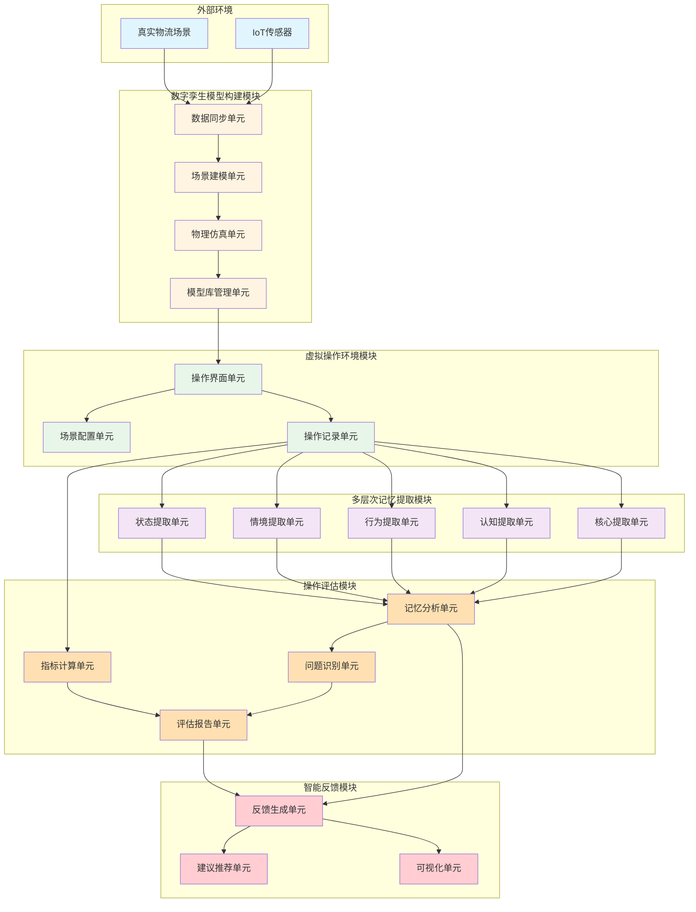
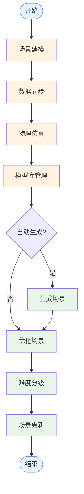
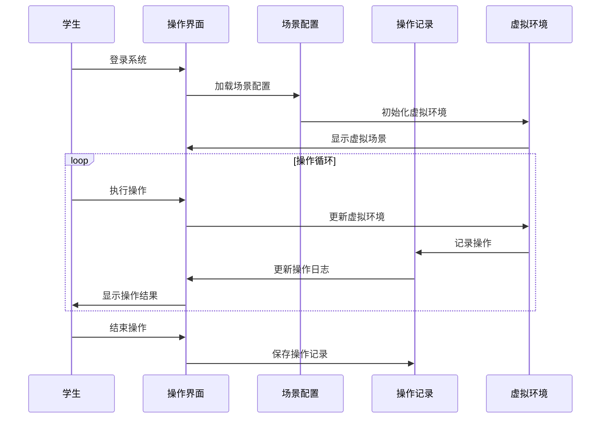
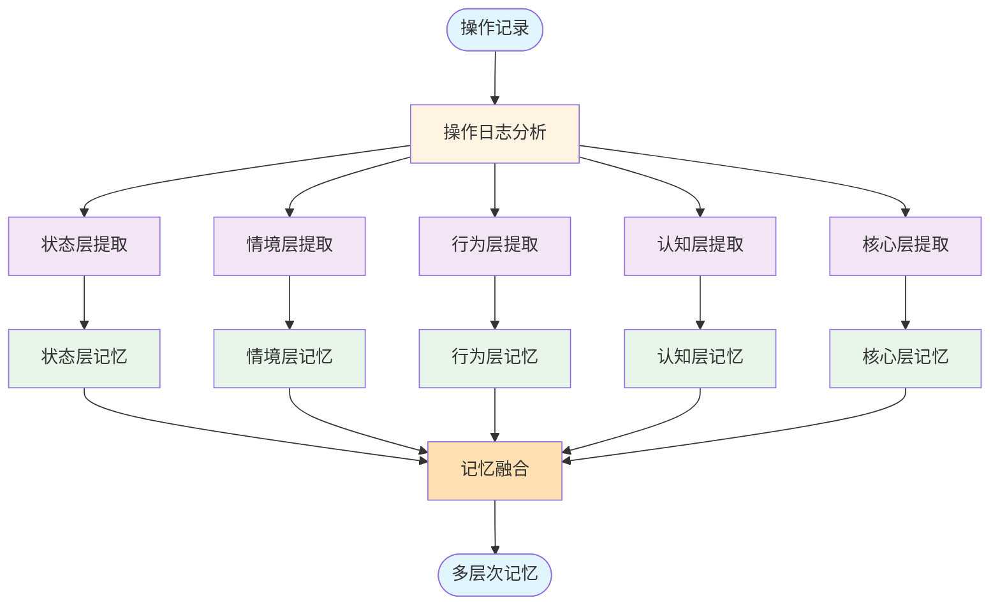
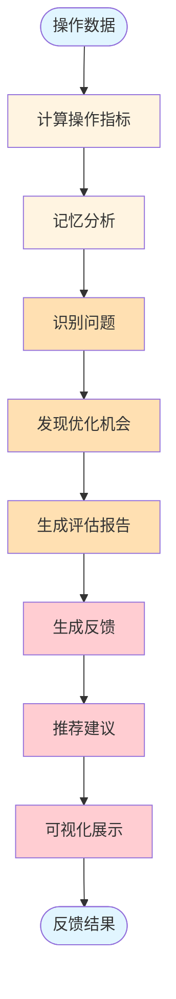
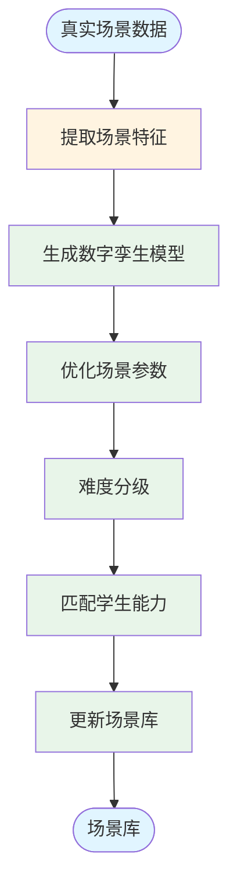

# 附图（Mermaid图表）

## 图1：系统整体架构图

```mermaid
graph TB
    subgraph 外部环境
        RealScene[真实物流场景]
        IoT[IoT传感器]
    end
    
    subgraph 数字孪生模型构建模块
        SceneModel[场景建模单元]
        DataSync[数据同步单元]
        Physics[物理仿真单元]
        ModelLib[模型库管理单元]
    end
    
    subgraph 虚拟操作环境模块
        UI[操作界面单元]
        Config[场景配置单元]
        Record[操作记录单元]
    end
    
    subgraph 多层次记忆提取模块
        StateExt[状态提取单元]
        ContextExt[情境提取单元]
        BehaviorExt[行为提取单元]
        CognitionExt[认知提取单元]
        CoreExt[核心提取单元]
    end
    
    subgraph 操作评估模块
        Metrics[指标计算单元]
        MemoryAnalysis[记忆分析单元]
        ProblemID[问题识别单元]
        Report[评估报告单元]
    end
    
    subgraph 智能反馈模块
        Feedback[反馈生成单元]
        Suggestion[建议推荐单元]
        Visual[可视化单元]
    end
    
    RealScene --> DataSync
    IoT --> DataSync
    DataSync --> SceneModel
    SceneModel --> Physics
    Physics --> ModelLib
    
    ModelLib --> UI
    UI --> Config
    UI --> Record
    
    Record --> StateExt
    Record --> ContextExt
    Record --> BehaviorExt
    Record --> CognitionExt
    Record --> CoreExt
    
    StateExt --> MemoryAnalysis
    ContextExt --> MemoryAnalysis
    BehaviorExt --> MemoryAnalysis
    CognitionExt --> MemoryAnalysis
    CoreExt --> MemoryAnalysis
    
    Record --> Metrics
    MemoryAnalysis --> ProblemID
    Metrics --> Report
    ProblemID --> Report
    
    Report --> Feedback
    MemoryAnalysis --> Feedback
    Feedback --> Suggestion
    Feedback --> Visual
    
    style RealScene fill:#e1f5ff
    style IoT fill:#e1f5ff
    style SceneModel fill:#fff4e1
    style DataSync fill:#fff4e1
    style Physics fill:#fff4e1
    style ModelLib fill:#fff4e1
    style UI fill:#e8f5e9
    style Config fill:#e8f5e9
    style Record fill:#e8f5e9
    style StateExt fill:#f3e5f5
    style ContextExt fill:#f3e5f5
    style BehaviorExt fill:#f3e5f5
    style CognitionExt fill:#f3e5f5
    style CoreExt fill:#f3e5f5
    style Metrics fill:#ffe0b2
    style MemoryAnalysis fill:#ffe0b2
    style ProblemID fill:#ffe0b2
    style Report fill:#ffe0b2
    style Feedback fill:#ffcdd2
    style Suggestion fill:#ffcdd2
    style Visual fill:#ffcdd2
```

## 图2：数字孪生模型构建流程图

```mermaid
flowchart TD
    Start([开始]) --> SceneModel[场景建模]
    SceneModel --> DataSync[数据同步]
    DataSync --> Physics[物理仿真]
    Physics --> ModelLib[模型库管理]
    ModelLib --> AutoGen{自动生成?}
    AutoGen -->|是| GenScene[生成场景]
    AutoGen -->|否| Optimize[优化场景]
    GenScene --> Optimize
    Optimize --> Grade[难度分级]
    Grade --> Update[场景更新]
    Update --> End([结束])
    
    style Start fill:#e1f5ff
    style SceneModel fill:#fff4e1
    style DataSync fill:#fff4e1
    style Physics fill:#fff4e1
    style ModelLib fill:#fff4e1
    style GenScene fill:#e8f5e9
    style Optimize fill:#e8f5e9
    style Grade fill:#e8f5e9
    style Update fill:#e8f5e9
    style End fill:#e1f5ff
```

## 图3：虚拟操作环境交互流程图

```mermaid
sequenceDiagram
    participant Student as 学生
    participant UI as 操作界面
    participant Config as 场景配置
    participant Record as 操作记录
    participant VirtualEnv as 虚拟环境
    
    Student->>UI: 登录系统
    UI->>Config: 加载场景配置
    Config->>VirtualEnv: 初始化虚拟环境
    VirtualEnv->>UI: 显示虚拟场景
    
    loop 操作循环
        Student->>UI: 执行操作
        UI->>VirtualEnv: 更新虚拟环境
        VirtualEnv->>Record: 记录操作
        Record->>UI: 更新操作日志
        UI->>Student: 显示操作结果
    end
    
    Student->>UI: 结束操作
    UI->>Record: 保存操作记录
```

## 图4：多层次记忆提取流程图

```mermaid
flowchart TD
    Start([操作记录]) --> LogAnalysis[操作日志分析]
    LogAnalysis --> StateExt[状态层提取]
    LogAnalysis --> ContextExt[情境层提取]
    LogAnalysis --> BehaviorExt[行为层提取]
    LogAnalysis --> CognitionExt[认知层提取]
    LogAnalysis --> CoreExt[核心层提取]
    
    StateExt --> StateMem[状态层记忆]
    ContextExt --> ContextMem[情境层记忆]
    BehaviorExt --> BehaviorMem[行为层记忆]
    CognitionExt --> CognitionMem[认知层记忆]
    CoreExt --> CoreMem[核心层记忆]
    
    StateMem --> MemoryFusion[记忆融合]
    ContextMem --> MemoryFusion
    BehaviorMem --> MemoryFusion
    CognitionMem --> MemoryFusion
    CoreMem --> MemoryFusion
    
    MemoryFusion --> End([多层次记忆])
    
    style Start fill:#e1f5ff
    style LogAnalysis fill:#fff4e1
    style StateExt fill:#f3e5f5
    style ContextExt fill:#f3e5f5
    style BehaviorExt fill:#f3e5f5
    style CognitionExt fill:#f3e5f5
    style CoreExt fill:#f3e5f5
    style StateMem fill:#e8f5e9
    style ContextMem fill:#e8f5e9
    style BehaviorMem fill:#e8f5e9
    style CognitionMem fill:#e8f5e9
    style CoreMem fill:#e8f5e9
    style MemoryFusion fill:#ffe0b2
    style End fill:#e1f5ff
```

## 图5：操作评估和反馈流程图

```mermaid
flowchart TD
    Start([操作数据]) --> Metrics[计算操作指标]
    Metrics --> MemoryAnalysis[记忆分析]
    MemoryAnalysis --> ProblemID[识别问题]
    ProblemID --> Optimize[发现优化机会]
    Optimize --> Report[生成评估报告]
    Report --> Feedback[生成反馈]
    Feedback --> Suggestion[推荐建议]
    Suggestion --> Visual[可视化展示]
    Visual --> End([反馈结果])
    
    style Start fill:#e1f5ff
    style Metrics fill:#fff4e1
    style MemoryAnalysis fill:#fff4e1
    style ProblemID fill:#ffe0b2
    style Optimize fill:#ffe0b2
    style Report fill:#ffe0b2
    style Feedback fill:#ffcdd2
    style Suggestion fill:#ffcdd2
    style Visual fill:#ffcdd2
    style End fill:#e1f5ff
```

## 图6：场景自动生成和优化流程图

```mermaid
flowchart TD
    Start([真实场景数据]) --> Extract[提取场景特征]
    Extract --> Generate[生成数字孪生模型]
    Generate --> Optimize[优化场景参数]
    Optimize --> Grade[难度分级]
    Grade --> Match[匹配学生能力]
    Match --> Update[更新场景库]
    Update --> End([场景库])
    
    style Start fill:#e1f5ff
    style Extract fill:#fff4e1
    style Generate fill:#e8f5e9
    style Optimize fill:#e8f5e9
    style Grade fill:#e8f5e9
    style Match fill:#e8f5e9
    style Update fill:#e8f5e9
    style End fill:#e1f5ff
```
