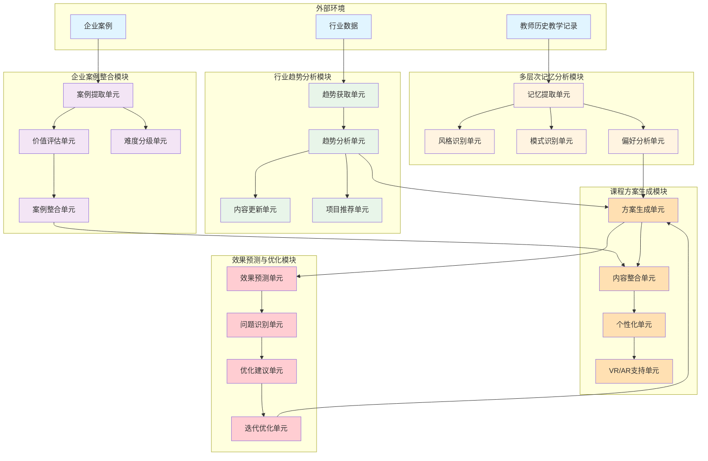
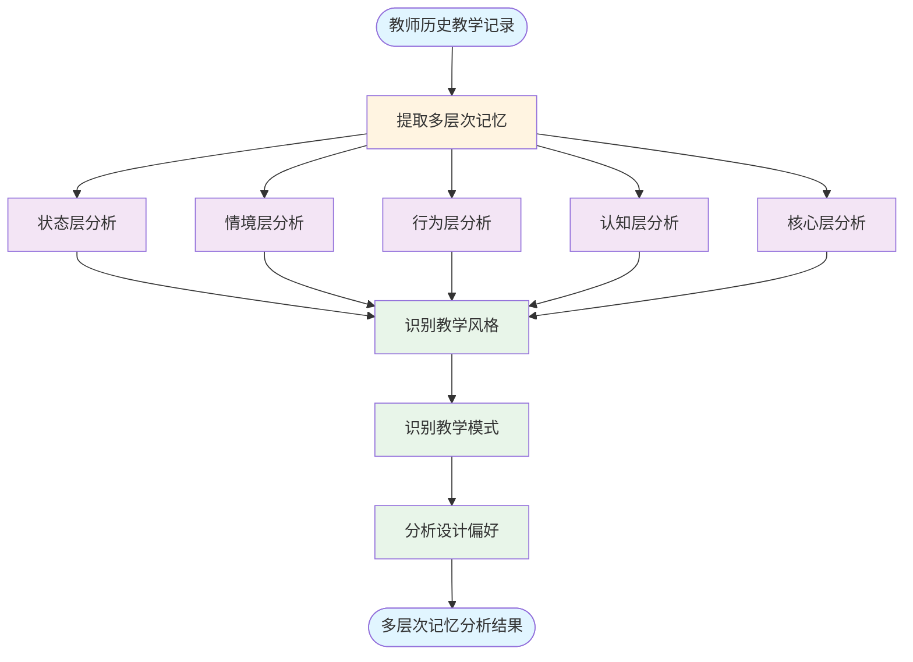
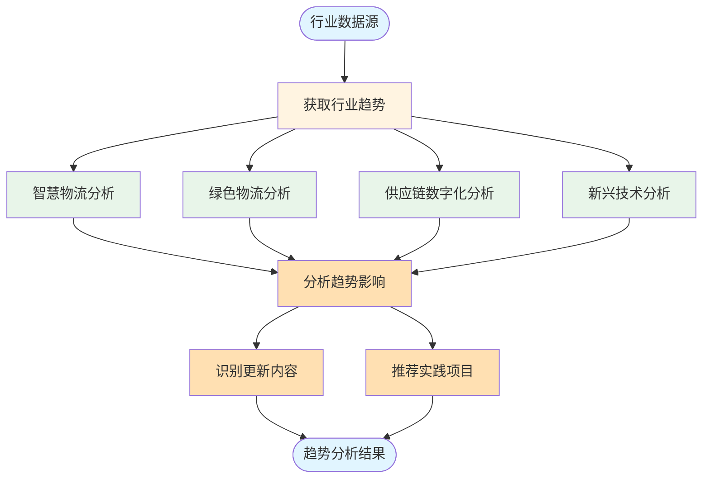
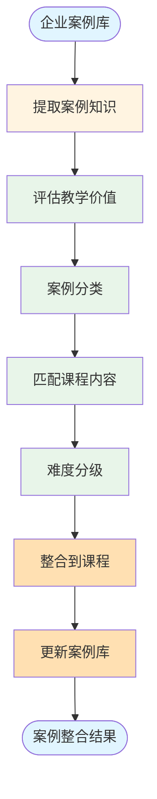
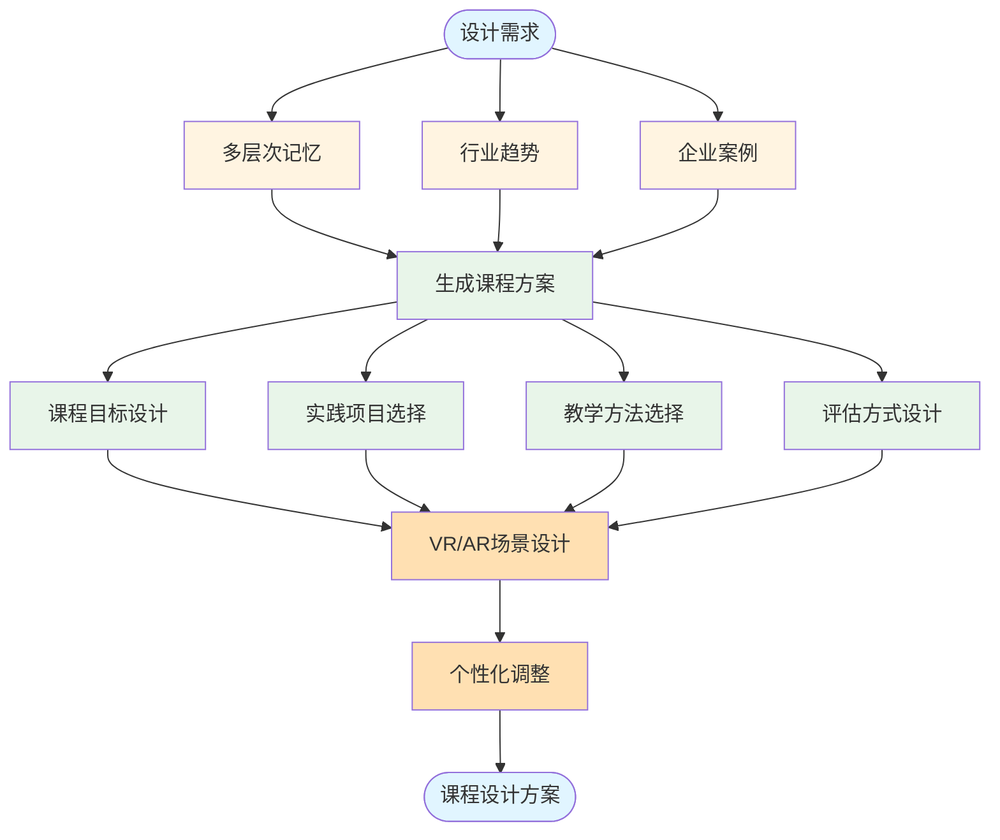
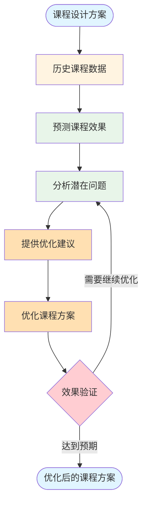

# 附图（Mermaid图表）

## 图1：系统整体架构图

```mermaid
graph TB
    subgraph 外部环境
        TeacherRecord[教师历史教学记录]
        IndustryData[行业数据]
        EnterpriseCase[企业案例]
    end
    
    subgraph 多层次记忆分析模块
        MemoryExt[记忆提取单元]
        StyleID[风格识别单元]
        PatternID[模式识别单元]
        Preference[偏好分析单元]
    end
    
    subgraph 行业趋势分析模块
        TrendGet[趋势获取单元]
        TrendAnalysis[趋势分析单元]
        ContentUpdate[内容更新单元]
        ProjectRec[项目推荐单元]
    end
    
    subgraph 企业案例整合模块
        CaseExt[案例提取单元]
        ValueEval[价值评估单元]
        CaseIntegrate[案例整合单元]
        Difficulty[难度分级单元]
    end
    
    subgraph 课程方案生成模块
        SchemeGen[方案生成单元]
        ContentIntegrate[内容整合单元]
        Personalize[个性化单元]
        VRAR[VR/AR支持单元]
    end
    
    subgraph 效果预测与优化模块
        EffectPred[效果预测单元]
        ProblemID[问题识别单元]
        Optimize[优化建议单元]
        Iterate[迭代优化单元]
    end
    
    TeacherRecord --> MemoryExt
    MemoryExt --> StyleID
    MemoryExt --> PatternID
    MemoryExt --> Preference
    
    IndustryData --> TrendGet
    TrendGet --> TrendAnalysis
    TrendAnalysis --> ContentUpdate
    TrendAnalysis --> ProjectRec
    
    EnterpriseCase --> CaseExt
    CaseExt --> ValueEval
    ValueEval --> CaseIntegrate
    CaseExt --> Difficulty
    
    Preference --> SchemeGen
    TrendAnalysis --> SchemeGen
    CaseIntegrate --> ContentIntegrate
    SchemeGen --> ContentIntegrate
    ContentIntegrate --> Personalize
    Personalize --> VRAR
    
    SchemeGen --> EffectPred
    EffectPred --> ProblemID
    ProblemID --> Optimize
    Optimize --> Iterate
    Iterate --> SchemeGen
    
    style TeacherRecord fill:#e1f5ff
    style IndustryData fill:#e1f5ff
    style EnterpriseCase fill:#e1f5ff
    style MemoryExt fill:#fff4e1
    style StyleID fill:#fff4e1
    style PatternID fill:#fff4e1
    style Preference fill:#fff4e1
    style TrendGet fill:#e8f5e9
    style TrendAnalysis fill:#e8f5e9
    style ContentUpdate fill:#e8f5e9
    style ProjectRec fill:#e8f5e9
    style CaseExt fill:#f3e5f5
    style ValueEval fill:#f3e5f5
    style CaseIntegrate fill:#f3e5f5
    style Difficulty fill:#f3e5f5
    style SchemeGen fill:#ffe0b2
    style ContentIntegrate fill:#ffe0b2
    style Personalize fill:#ffe0b2
    style VRAR fill:#ffe0b2
    style EffectPred fill:#ffcdd2
    style ProblemID fill:#ffcdd2
    style Optimize fill:#ffcdd2
    style Iterate fill:#ffcdd2
```

## 图2：多层次记忆分析流程图

```mermaid
flowchart TD
    Start([教师历史教学记录]) --> Extract[提取多层次记忆]
    Extract --> State[状态层分析]
    Extract --> Context[情境层分析]
    Extract --> Behavior[行为层分析]
    Extract --> Cognition[认知层分析]
    Extract --> Core[核心层分析]
    
    State --> Style[识别教学风格]
    Context --> Style
    Behavior --> Style
    Cognition --> Style
    Core --> Style
    
    Style --> Pattern[识别教学模式]
    Pattern --> Preference[分析设计偏好]
    Preference --> End([多层次记忆分析结果])
    
    style Start fill:#e1f5ff
    style Extract fill:#fff4e1
    style State fill:#f3e5f5
    style Context fill:#f3e5f5
    style Behavior fill:#f3e5f5
    style Cognition fill:#f3e5f5
    style Core fill:#f3e5f5
    style Style fill:#e8f5e9
    style Pattern fill:#e8f5e9
    style Preference fill:#e8f5e9
    style End fill:#e1f5ff
```

## 图3：行业趋势分析流程图

```mermaid
flowchart TD
    Start([行业数据源]) --> Get[获取行业趋势]
    Get --> Smart[智慧物流分析]
    Get --> Green[绿色物流分析]
    Get --> Digital[供应链数字化分析]
    Get --> NewTech[新兴技术分析]
    
    Smart --> Impact[分析趋势影响]
    Green --> Impact
    Digital --> Impact
    NewTech --> Impact
    
    Impact --> Update[识别更新内容]
    Impact --> Recommend[推荐实践项目]
    
    Update --> End([趋势分析结果])
    Recommend --> End
    
    style Start fill:#e1f5ff
    style Get fill:#fff4e1
    style Smart fill:#e8f5e9
    style Green fill:#e8f5e9
    style Digital fill:#e8f5e9
    style NewTech fill:#e8f5e9
    style Impact fill:#ffe0b2
    style Update fill:#ffe0b2
    style Recommend fill:#ffe0b2
    style End fill:#e1f5ff
```

## 图4：企业案例整合流程图

```mermaid
flowchart TD
    Start([企业案例库]) --> Extract[提取案例知识]
    Extract --> Eval[评估教学价值]
    Eval --> Classify[案例分类]
    Classify --> Match[匹配课程内容]
    Match --> Grade[难度分级]
    Grade --> Integrate[整合到课程]
    Integrate --> Update[更新案例库]
    Update --> End([案例整合结果])
    
    style Start fill:#e1f5ff
    style Extract fill:#fff4e1
    style Eval fill:#e8f5e9
    style Classify fill:#e8f5e9
    style Match fill:#e8f5e9
    style Grade fill:#e8f5e9
    style Integrate fill:#ffe0b2
    style Update fill:#ffe0b2
    style End fill:#e1f5ff
```

## 图5：课程方案生成流程图

```mermaid
flowchart TD
    Start([设计需求]) --> Memory[多层次记忆]
    Start --> Trend[行业趋势]
    Start --> Case[企业案例]
    
    Memory --> Generate[生成课程方案]
    Trend --> Generate
    Case --> Generate
    
    Generate --> Goal[课程目标设计]
    Generate --> Project[实践项目选择]
    Generate --> Method[教学方法选择]
    Generate --> Assess[评估方式设计]
    
    Goal --> VRAR[VR/AR场景设计]
    Project --> VRAR
    Method --> VRAR
    Assess --> VRAR
    
    VRAR --> Personalize[个性化调整]
    Personalize --> End([课程设计方案])
    
    style Start fill:#e1f5ff
    style Memory fill:#fff4e1
    style Trend fill:#fff4e1
    style Case fill:#fff4e1
    style Generate fill:#e8f5e9
    style Goal fill:#e8f5e9
    style Project fill:#e8f5e9
    style Method fill:#e8f5e9
    style Assess fill:#e8f5e9
    style VRAR fill:#ffe0b2
    style Personalize fill:#ffe0b2
    style End fill:#e1f5ff
```

## 图6：效果预测与优化流程图

```mermaid
flowchart TD
    Start([课程设计方案]) --> History[历史课程数据]
    History --> Predict[预测课程效果]
    Predict --> Analyze[分析潜在问题]
    Analyze --> Suggest[提供优化建议]
    Suggest --> Optimize[优化课程方案]
    Optimize --> Validate{效果验证}
    Validate -->|需要继续优化| Analyze
    Validate -->|达到预期| End([优化后的课程方案])
    
    style Start fill:#e1f5ff
    style History fill:#fff4e1
    style Predict fill:#e8f5e9
    style Analyze fill:#e8f5e9
    style Suggest fill:#ffe0b2
    style Optimize fill:#ffe0b2
    style Validate fill:#ffcdd2
    style End fill:#e1f5ff
```
