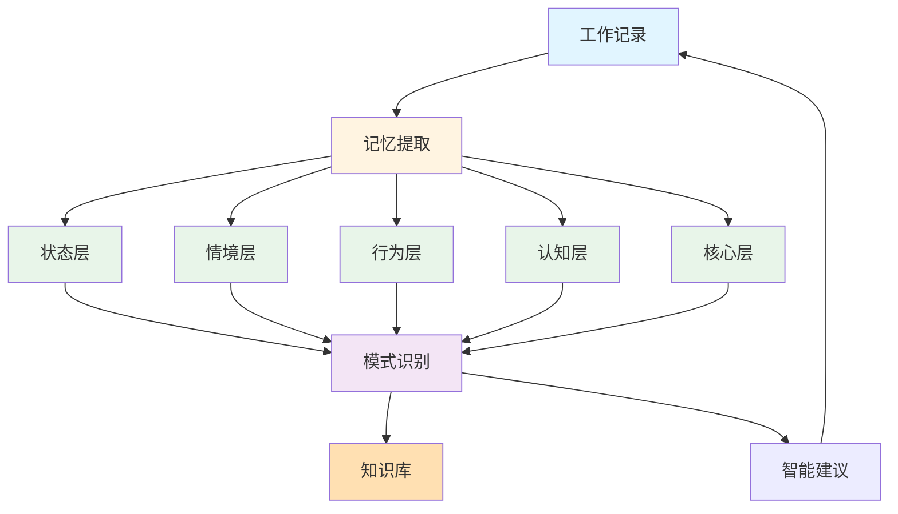

# AI as me 工作协作平台

## 系统介绍

AI as me 工作协作平台是一个多层次的智能工作伙伴系统，专为功能安全专家设计，支持日常工作、团队管理、知识积累，逐步形成从状态层到核心层的完整记忆架构，实现深度协作与融合。

### 核心理念

- **多层次记忆**：在状态层、情境层、行为层、认知层、核心层逐步建立记忆
- **工作闭环**：问题→分析→解决→总结→模式提取→优化→新问题
- **知识沉淀**：将工作经验转化为可复用的知识库和工作模式
- **认知融合**：在思维模式、决策框架、价值观等层面深度协作
- **AI as me**：最终实现"相辅相成，融为一体"的目标

### 与学习探索系统的区别

| 特性 | 学习探索系统 | 工作协作平台 |
|------|------------|------------|
| 用途 | 教育、自由探索 | 工作协作、专业支持 |
| 用户 | 小朋友 | 功能安全专家 |
| 重点 | 兴趣驱动、知识探索 | 专业精准、工作闭环 |
| 记忆架构 | 知识图谱、兴趣追踪 | 多层次记忆架构 |
| 适用场景 | 学习、探索 | 工作、管理、决策 |

**两者独立运行**：学习探索系统用于教育，工作平台用于工作协作。

---

## 快速开始

### 1. 打开系统

在Cursor中打开本项目目录：
```
study-systems/ai-as-me-workplace/
```

### 2. 开始工作

直接在Cursor聊天窗口输入你的工作需求，例如：
- "如何设计ASIL D的监控机制用于智驾算法冗余？"
- "我需要为XX项目编写安全计划"
- "帮我分配XX项目的功能安全任务"
- "明天要和XX主机厂讨论安全需求，帮我准备一下"

AI会基于你的背景、知识库和记忆提供专业支持。

### 3. 查看记录

你的工作会自动记录在：
- `work/` - 工作记录（项目、任务、文档、会议、决策）
- `team/` - 团队管理（任务分配、进度跟踪、协作记录）
- `knowledge/` - 知识库（标准知识、技术知识、工作模式）
- `memory/` - 记忆架构（状态、情境、行为、认知、核心层）
- `insights/` - 洞察和总结（周度洞察、月度回顾、成长追踪）
- `profile/` - 工作画像（工作画像、专业能力地图、协作风格）
- `capabilities/` - AI能力（Skill、Agent、MCP、本地工具）

---

## 系统功能

### 1. 工作协作

#### 项目管理
- 项目规划、进度跟踪、风险识别
- 项目记录：`work/projects/projects/`

#### 任务管理
- 任务分解、优先级、状态跟踪
- 任务记录：`work/tasks/tasks/`

#### 文档协作
- 文档编写、评审、版本管理
- 文档记录：`work/documents/documents/`

#### 会议记录
- 会议纪要、行动项跟踪
- 会议记录：`work/meetings/meetings/`

#### 决策记录
- 决策过程、依据、结果、反思
- 决策记录：`work/decisions/decisions/`

### 2. 团队管理

#### 任务分配
- 任务分解、人员分配、责任明确
- 分配记录：`team/assignments/assignments/`

#### 进度跟踪
- 个人进度、团队进度、项目进度
- 进度跟踪：`team/progress/progress-tracker.md`

#### 跨部门协作
- 协作记录、沟通要点、成果跟踪
- 协作记录：`team/collaboration/collaborations/`

#### 工作汇报
- 自动生成周度/月度工作汇报
- 工作汇报：`team/reviews/`

### 3. 知识库系统

#### 标准知识
- ISO 26262、ISO 21448、UNECE法规等
- 标准知识：`knowledge/standards/`

#### 技术知识
- 域控制器架构、安全机制、最佳实践
- 技术知识：`knowledge/technical/`

#### 工作模式
- 问题解决模式、决策模式、沟通模式、团队管理模式
- 工作模式：`knowledge/patterns/`

#### 问题抽象知识
- 根节点问题库、简化模型库、泛化模式库、表示空间映射
- 问题抽象知识：`knowledge/problem-abstraction/`

#### 经验教训
- 工作决策、成功经验、失败教训
- 经验教训：`knowledge/lessons-learned/`

### 4. 多层次记忆架构（核心）

#### 状态层（State Layer）
- 记录当前工作状态（项目、任务、优先级）
- 追踪状态变化历史
- 识别状态模式（高压力期、创新期、稳定期）
- 文件：`memory/state/`

#### 情境层（Context Layer）
- 记录工作情境（项目背景、团队状态、客户需求）
- 识别情境模式（紧急项目、长期规划、客户沟通）
- 建立情境-行为关联
- 文件：`memory/context/`

#### 行为层（Behavior Layer）
- 记录具体行动（决策、沟通、执行）
- 分析行为有效性
- 识别高效行为模式
- 文件：`memory/behavior/`

#### 认知层（Cognition Layer）
- **思维模式**：系统思维、风险思维、创新思维等
- **决策框架**：风险评估框架、优先级判断框架等
- **认知偏好**：偏好结构化、偏好创新、偏好数据驱动等
- **推理轨迹**：重要决策的推理过程
- 文件：`memory/cognition/`

#### 核心层（Core Layer）
- **价值观**：专业精准、团队协作、持续改进等
- **性格特征**：严谨、创新、领导力等
- **核心原则**：提炼的核心工作原则
- **演变记录**：核心层的演变过程
- 文件：`memory/core/`

### 5. 洞察与总结

#### 周度洞察
- 每周自动总结工作亮点、问题、模式
- 文件：`insights/weekly-insights.md`

#### 月度回顾
- 深度回顾、成长分析、模式发现
- 文件：`insights/monthly-review.md`

#### 成长追踪
- 能力提升、知识积累、认知演进
- 文件：`insights/growth-tracker.md`

#### 模式发现
- 自动发现工作模式、决策模式、行为模式
- 文件：`insights/pattern-discovery.md`

### 6. AI能力扩展架构

#### 能力类型
- **Skill能力**：单一功能的AI能力（如文档分析、代码生成等）
- **Agent能力**：具有自主决策能力的AI代理
- **MCP能力**：通过MCP协议集成的外部服务
- **本地工具**：封装为Skill的本地工具

#### 能力注册
- 所有能力需要在`capabilities/registry.md`注册
- 使用标准模板创建能力定义
- 支持能力版本管理和状态管理

#### 能力调用
- 根据用户请求自动选择合适的能力
- 支持能力组合和调用链
- 记录所有能力使用情况

#### 能力管理
- 使用记录：`capabilities/usage/usage-history.md`
- 效果分析：`capabilities/usage/effectiveness.md`
- 能力知识库：`knowledge/capabilities/`
- 能力记忆：`memory/capabilities/`

### 7. 飞书API集成

#### 已集成能力
- **MCP-001**：飞书API集成（MCP）
- **SKILL-001**：飞书API封装工具（Skill）

#### 支持功能
- 飞书消息通讯
- 飞书Wiki云文档操作
- 飞书在线表格操作
- 飞书多维表格操作
- 飞书项目工作项管理
- 飞书项目流程管理

#### 重要要求
- **所有飞书API调用必须参考reference文档**
- Reference文档位置：`c:\Users\colin.lin\.cursor\cursor-projects\tools\feishu interaction\reference\`
- 调用前必须查阅对应的API文档（`api_docs/`目录）
- 必须遵循API文档中的格式要求

#### 使用指南
- 详细使用指南：`capabilities/skills/skills/FEISHU-API-GUIDE.md`
- API文档索引：`reference/api_docs/_index.md`
- 快速开始示例：`reference/quick_start_example.py`

#### 已实现工具
- **SKILL-002 飞书多维表格今日更新总结**：
  - 功能：获取飞书多维表格或项目表格视图的今日更新记录并生成总结
  - 实现文件：`capabilities/skills/skills/feishu_bitable_daily_summary.py`
  - 使用方式：直接说"我想知道这个飞书多维表格今天的更新记录总结"，并提供表格链接或ID

---

## 使用场景示例

### 场景1：技术问题分析

**用户**："如何设计ASIL D的监控机制用于智驾算法冗余？"

**AI回应**：
"这是一个典型的冗余监控设计问题。基于ISO 26262，ASIL D需要...

让我从几个角度来分析：
1. 监控机制的选择（看门狗、自检、交叉验证等）
2. 检测覆盖率要求
3. 与现有架构的集成
4. 客户特定要求（SEooC vs 定制开发）

基于你之前的项目经验，我注意到你在XX项目中采用了...
这次是否需要考虑不同的约束？"

**结果**：
- 创建技术分析记录
- 更新知识库（安全机制相关）
- 记录推理轨迹（认知层）
- 提取工作模式（如果形成新模式）

### 场景2：团队任务分配

**用户**："我需要为XX项目分配功能安全任务"

**AI回应**：
"让我先了解一下项目规模和团队情况...

基于你团队的历史模式，我建议：
1. FSC/TSC设计：分配给XX（基于其经验）
2. FMEA分析：分配给XX（基于其技能）
3. 安全需求协调：你亲自负责（跨部门协作）

需要注意的风险：
- 时间节点：XX阶段可能紧张
- 资源冲突：XX同时参与多个项目
- 客户沟通：需要提前准备XX材料"

**结果**：
- 创建任务分配记录
- 更新团队进度跟踪
- 记录分配决策（行为层）
- 更新任务分配模式

### 场景3：客户对接

**用户**："明天要和XX主机厂讨论安全需求，帮我准备一下"

**AI回应**：
"基于之前的对接经验，我建议：
1. 重点准备：XX（基于客户关注点）
2. 沟通策略：XX（基于历史沟通模式）
3. 风险预案：XX（基于可能的问题）

需要注意：
- 客户可能关注XX（基于行业趋势）
- 上次对接中XX问题需要跟进
- 建议准备XX材料作为支撑"

**结果**：
- 记录客户对接准备
- 更新客户对接模式
- 记录沟通策略（行为层）

### 场景4：生活方式探索

**用户**："我想探索一下工作与生活的平衡"

**AI回应**：
"基于你的核心层（价值观、性格特征），我注意到你重视专业精准和持续改进...

让我从几个角度来探索：
1. 当前工作负荷分析（状态层）
2. 时间分配优化建议
3. 工作方式调整建议
4. 生活方式探索方向"

**结果**：
- 记录生活方式探索
- 更新工作画像
- 记录核心层洞察

---

## 多层次记忆架构说明

### 记忆架构层次



### 记忆提取机制

#### 从工作记录中提取
- **状态层**：从项目、任务记录中提取当前状态
- **情境层**：从项目背景、会议记录中提取情境
- **行为层**：从决策、沟通记录中提取行为
- **认知层**：从决策推理、问题分析中提取认知
- **核心层**：从价值观表达、原则提炼中提取核心

#### 模式识别
- 从各层记忆中识别模式
- 建立模式之间的关联
- 形成工作模式库

#### 智能建议
- 基于记忆和模式提供个性化建议
- 考虑状态、情境、行为、认知、核心层
- 形成闭环优化

---

## 文件结构

```
ai-as-me-workplace/
├── CURSOR.md                    # AI as me 核心指令文件（工作版）
├── README.md                    # 系统说明文档（本文件）
│
├── work/                        # 工作协作目录
│   ├── projects/                # 项目管理
│   │   ├── PROJECT-TEMPLATE.md
│   │   └── projects/            # 具体项目记录
│   ├── tasks/                   # 任务管理
│   │   ├── TASK-TEMPLATE.md
│   │   └── tasks/               # 具体任务记录
│   ├── documents/               # 文档协作
│   │   ├── DOCUMENT-TEMPLATE.md
│   │   └── documents/           # 具体文档记录
│   ├── meetings/                # 会议记录
│   │   ├── MEETING-TEMPLATE.md
│   │   └── meetings/             # 具体会议记录
│   └── decisions/               # 决策记录
│       ├── DECISION-TEMPLATE.md
│       └── decisions/           # 具体决策记录
│   └── problems/                # 问题分析记录
│       ├── PROBLEM-TEMPLATE.md
│       └── problems/            # 具体问题分析记录
│
├── team/                        # 团队管理目录
│   ├── team-structure.md        # 团队结构
│   ├── assignments/            # 任务分配
│   │   ├── ASSIGNMENT-TEMPLATE.md
│   │   └── assignments/         # 具体分配记录
│   ├── progress/                # 进度跟踪
│   │   ├── progress-tracker.md  # 进度总览
│   │   └── weekly-reports/      # 周度报告
│   ├── collaboration/           # 跨部门协作
│   │   ├── COLLABORATION-TEMPLATE.md
│   │   └── collaborations/      # 具体协作记录
│   └── reviews/                 # 工作汇报
│
├── knowledge/                   # 知识库目录
│   ├── knowledge-base.md        # 知识库索引
│   ├── standards/               # 标准知识
│   │   ├── ISO-26262/          # ISO 26262相关
│   │   ├── ISO-21448/          # ISO 21448相关
│   │   └── regulations/        # 法规（UNECE R155/R156等）
│   ├── technical/               # 技术知识
│   │   ├── architecture/       # 架构知识
│   │   ├── safety-mechanisms/  # 安全机制
│   │   └── best-practices/     # 最佳实践
│   ├── patterns/                # 工作模式库
│   │   ├── problem-solving/    # 问题解决模式
│   │   ├── decision-making/   # 决策模式
│   │   ├── communication/     # 沟通模式
│   │   └── team-management/    # 团队管理模式
│   ├── problem-abstraction/     # 问题抽象知识库
│   │   ├── root-problems/      # 根节点问题库
│   │   ├── simplified-models/  # 简化模型库
│   │   ├── generalization-patterns/ # 泛化模式库
│   │   └── representation-space/ # 表示空间映射
│   └── lessons-learned/         # 经验教训
│
├── memory/                      # 记忆架构目录（核心）
│   ├── state/                   # 状态层
│   │   ├── current-state.md    # 当前状态
│   │   └── state-history.md    # 状态历史
│   ├── context/                 # 情境层
│   │   ├── work-contexts/      # 工作情境
│   │   ├── project-contexts/   # 项目情境
│   │   └── context-patterns.md # 情境模式
│   ├── behavior/                # 行为层
│   │   ├── behavior-patterns.md # 行为模式
│   │   ├── action-history.md   # 行动历史
│   │   └── effectiveness.md    # 行为有效性分析
│   ├── cognition/               # 认知层
│   │   ├── thinking-models.md  # 思维模式
│   │   ├── decision-frameworks.md # 决策框架
│   │   ├── cognitive-preferences.md # 认知偏好
│   │   ├── reasoning-traces.md # 推理轨迹
│   │   └── problem-abstraction-layer.md # 问题抽象层
│   └── core/                    # 核心层
│       ├── values.md            # 价值观
│       ├── personality.md       # 性格特征
│       ├── principles.md        # 核心原则
│       └── evolution.md         # 核心层演变记录
│
├── insights/                    # 洞察和总结
│   ├── weekly-insights.md       # 周度洞察
│   ├── monthly-review.md        # 月度回顾
│   ├── growth-tracker.md        # 成长追踪
│   └── pattern-discovery.md     # 模式发现
│
├── profile/                     # 工作画像
│   ├── work-profile.md          # 工作画像（角色、职责、能力）
│   ├── expertise-map.md         # 专业能力地图
│   └── collaboration-style.md   # 协作风格
│
└── capabilities/                # AI能力目录
    ├── registry.md              # 能力注册表
    ├── capabilities-index.md    # 能力索引
    ├── skills/                  # Skill能力
    │   ├── SKILL-TEMPLATE.md    # Skill模板
    │   ├── skills/              # 具体Skill
    │   └── local-tools/         # 本地工具封装
    ├── agents/                  # Agent能力
    │   ├── AGENT-TEMPLATE.md    # Agent模板
    │   └── agents/              # 具体Agent
    ├── mcps/                    # MCP能力
    │   ├── MCP-TEMPLATE.md     # MCP模板
    │   └── mcps/                # 具体MCP
    ├── usage/                   # 使用记录
    │   ├── usage-history.md     # 使用历史
    │   └── effectiveness.md     # 使用效果分析
    └── integration/             # 集成配置
        ├── integration-config.md # 集成配置
        └── api-routes.md        # API路由配置
```

---

## 使用技巧

### 1. 如何开始工作

- **直接提问**：有任何工作问题都可以问
- **描述需求**：说"我需要..."或"帮我..."
- **分享情境**：分享工作情境，AI会基于记忆提供建议

### 2. 如何形成闭环

- **问题提出**：提出工作问题或需求
- **专业分析**：AI基于知识库和记忆提供分析
- **执行记录**：记录执行过程和结果
- **总结优化**：总结工作，提取模式，优化工作方式
- **新问题产生**：基于总结产生新的优化方向

### 3. 如何查看记录

- **工作记录**：查看`work/`目录了解具体工作
- **团队管理**：查看`team/`目录了解团队情况
- **知识库**：查看`knowledge/`目录了解知识积累
- **记忆架构**：查看`memory/`目录了解多层次记忆
- **洞察总结**：查看`insights/`目录了解工作洞察

### 4. 如何积累知识

- **主动记录**：重要工作主动记录
- **模式提取**：从工作中提取工作模式
- **经验沉淀**：将经验转化为知识库条目
- **持续优化**：基于反馈优化知识库

### 5. 如何使用问题抽象框架

当你遇到复杂问题时，可以使用问题抽象框架进行深入分析：

1. **简单化（本质抽象）**：问自己"这个问题的本质是什么？"去除冗余，提取核心要素
2. **根节点问题（问题溯源）**：问自己"导致这个问题的根本原因是什么？"构建问题树，找到根节点
3. **泛化（模式提取）**：问自己"这类问题有什么通用模式？"从具体问题抽象为通用模式
4. **表示空间（知识定位）**：问自己"这个问题在知识网络中的位置在哪里？"建立知识连接

**示例**：
- **问题**："Docker方案太复杂，但我想用Pandoc转换PDF"
- **简单化**：本质是"简单需求 vs 复杂方案"的匹配问题
- **根节点问题**：投入产出比不匹配
- **泛化**：实用性优先决策模式
- **表示空间**：技术方案选择领域，与投入产出比评估框架相关
- **结果**：采用浏览器打印方案，满足当前需求

详细说明请参考：[问题抽象与知识表示框架](knowledge/problem-abstraction/README.md)

---

## 常见问题

### Q1: 这个系统和学习探索系统有什么区别？

**A**: 学习探索系统用于教育（小朋友），工作协作平台用于工作（功能安全专家）。两者独立运行，互不干扰。

### Q2: 我需要手动记录所有工作吗？

**A**: 不需要！AI会自动记录重要工作。你只需要自然地和AI协作，提出工作需求。

### Q3: 多层次记忆架构是如何工作的？

**A**: AI会从你的工作记录中自动提取各层记忆：
- **状态层**：当前工作状态
- **情境层**：工作情境
- **行为层**：具体行动
- **认知层**：思维模式、决策框架
- **核心层**：价值观、性格特征

### Q4: 如何查看我的工作模式？

**A**: 查看`insights/pattern-discovery.md`了解发现的工作模式，或查看`knowledge/patterns/`了解工作模式库。

### Q5: 如何形成工作闭环？

**A**: 从问题开始，专业分析，执行记录，总结优化，提取模式，继续优化。AI会在适当时机引导你形成闭环。

### Q6: 如何使用AI能力（Skill、Agent、MCP）？

**A**: 直接描述需求即可，AI会自动从能力注册表中选择合适的能力。你也可以注册新能力或封装本地工具为Skill。

### Q7: 如何注册新的AI能力？

**A**: 使用标准模板（SKILL-TEMPLATE.md、AGENT-TEMPLATE.md、MCP-TEMPLATE.md）创建能力定义，然后在`capabilities/registry.md`中注册。

---

## 系统特点

### 1. 专业精准

- 基于ISO 26262、ISO 21448等标准提供准确建议
- 熟悉自动驾驶域控制器架构和安全机制
- 了解行业常见挑战和最佳实践

### 2. 场景化应对

- 针对Tier 1供应商角色提供实用建议
- 协助输出技术文档或评审要点
- 帮助分析具体技术问题

### 3. 多层次记忆

- 在状态、情境、行为、认知、核心层建立记忆
- 逐步形成完整的认知模型
- 实现深度协作与融合

### 4. 闭环优化

- 从工作中学习，优化工作模式
- 持续改进工作方式和决策框架
- 形成正闭环迭代

---

## 技术说明

### AI模型支持

这个系统设计为**模型无关**的架构，可以与多种大语言模型配合使用：

#### 在Cursor中使用
- **Cursor AI助手**：系统默认使用Cursor内置的AI助手（Auto）
- **模型选择**：Cursor支持多种模型，包括但不限于：
  - Claude系列（Anthropic）
  - GPT系列（OpenAI）
  - 其他兼容的大语言模型

#### 系统设计理念
- **模型无关**：系统的核心是交互逻辑和记录机制，不依赖特定模型
- **指令驱动**：通过`CURSOR.md`中的指令定义AI行为，适配不同模型
- **可扩展性**：理论上可以与任何支持指令遵循的大语言模型配合使用

### 系统架构
- **文件系统**：基于Markdown文件的轻量级存储
- **知识图谱**：使用Mermaid图表进行可视化
- **自动记录**：通过AI的文件操作能力自动维护记录

### 技术特点
- **无需数据库**：所有数据存储在Markdown文件中
- **版本控制友好**：所有文件都是文本格式，易于Git管理
- **跨平台**：可在任何支持Cursor的平台上使用

---

## 开始使用

现在就打开Cursor，开始你的工作协作之旅吧！

**记住**：
- 任何工作问题都可以问
- AI会基于你的背景和记忆提供专业支持
- 工作会自动记录，知识会持续沉淀
- 多层次记忆会逐步建立，最终实现深度融合

祝你工作顺利，持续成长！
