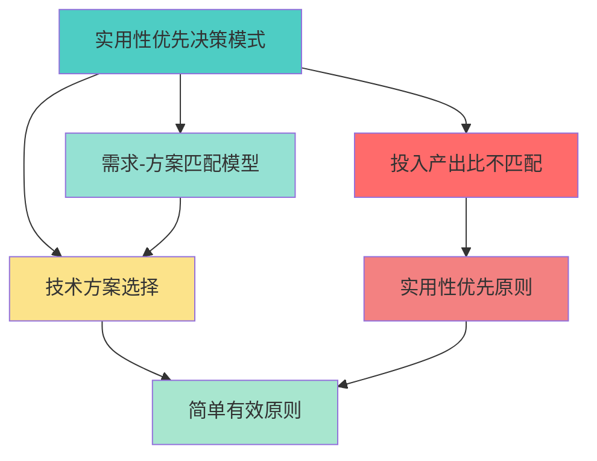

# 泛化模式库

**最后更新**：2026-01-16

---

## 泛化模式说明

泛化模式是通过"泛化（模式提取）"步骤从具体问题中抽象出的通用模式。这些模式可以应用于类似场景，帮助我们快速识别问题类型并选择合适的解决方案。

---

## 泛化模式索引

| 模式ID | 模式名称 | 问题类型 | 发现日期 | 适用场景 | 相关根节点问题 |
|--------|---------|---------|---------|---------|--------------|
| GEN-001 | 实用性优先决策模式 | 技术方案选择 | 2026-01-13 | 技术方案选择、工具评估、资源投入决策 | ROOT-001 |
| GEN-002 | [模式名称] | [问题类型] | YYYY-MM-DD | [适用场景] | [根节点问题] |

---

## 泛化模式详情

### GEN-001：实用性优先决策模式

- **模式描述**：在技术方案选择时，优先考虑方案的实用性和投入产出比，选择简单有效的方案，不盲目追求技术先进性
- **问题类型**：技术方案选择问题
- **适用场景**：
  - 技术方案选择
  - 工具评估
  - 资源投入决策
  - 复杂度与收益不匹配的情况
- **模式特征**：
  - 重视投入产出比
  - 优先选择简单有效的方案
  - 不盲目追求技术先进性
  - 考虑使用频率和场景
- **决策原则**：
  - 简单有效 > 技术先进
  - 实用性 > 完美性
  - 投入产出比 > 技术先进性
- **评估维度**：
  - 复杂度
  - 收益
  - 使用频率
  - 投入产出比
- **相关根节点问题**：[ROOT-001](../root-problems/README.md#root-001投入产出比不匹配)
- **相关简化模型**：[需求-方案匹配模型](../simplified-models/README.md#simple-001需求-方案匹配模型)
- **相关决策**：[DEC-001](../../work/decisions/decisions/20260113-pandoc-docker-decision.md)
- **相关模式**：[实用性优先模式](../../insights/pattern-discovery.md#模式2实用性优先模式)

---

## 模式提取方法

### 方法1：模式识别
- 识别问题中的重复模式
- 发现问题的共同特征
- 提取通用规律

### 方法2：抽象建模
- 从具体问题抽象到一般问题
- 建立抽象模型
- 定义模式特征

### 方法3：场景归纳
- 归纳相似场景
- 识别场景特征
- 提取场景模式

---

## 模式应用

### 应用步骤
1. **识别问题类型**：确定问题属于哪个泛化模式
2. **匹配模式特征**：检查问题是否符合模式特征
3. **应用决策原则**：使用模式的决策原则
4. **评估和决策**：基于模式评估并做出决策

### 应用示例

**问题**：需要选择PDF转换方案

**应用模式**：实用性优先决策模式

**分析**：
- 问题类型：技术方案选择 ✓
- 模式特征：复杂度与收益不匹配 ✓
- 决策原则：简单有效 > 技术先进
- 评估：Docker方案复杂但收益不明显，应选择简单方案

**结论**：采用浏览器打印方案（简单有效）

---

## 模式网络

---

## 关联记录

### 相关根节点问题
- [ROOT-001](../root-problems/README.md)

### 相关简化模型
- [需求-方案匹配模型](../simplified-models/README.md)

### 相关模式
- [实用性优先模式](../../insights/pattern-discovery.md)

### 相关决策
- [DEC-001](../../work/decisions/decisions/20260113-pandoc-docker-decision.md)
