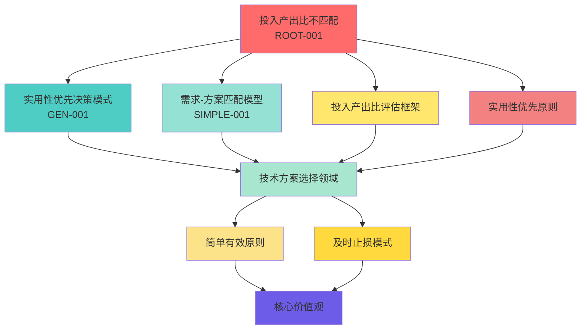

# 表示空间映射

**最后更新**：2026-01-16

---

## 表示空间说明

表示空间是知识在概念空间中的位置和连接关系。通过表示空间，我们可以：
- 定位问题在知识网络中的位置
- 发现知识之间的连接关系
- 找到相似问题和解决方案
- 建立知识图谱

---

## 知识领域划分

### 领域1：技术方案选择

- **核心概念**：
  - 投入产出比
  - 复杂度
  - 收益
  - 实用性
  - 简单有效
- **相关模式**：
  - 实用性优先决策模式
  - 投入产出比评估决策模式
  - 及时止损模式
- **相关决策框架**：
  - 投入产出比评估框架
- **相关原则**：
  - 实用性优先原则
  - 简单有效原则
- **问题类型**：
  - 技术决策
  - 工具选择
  - 资源投入决策
- **根节点问题**：
  - ROOT-001：投入产出比不匹配
- **简化模型**：
  - SIMPLE-001：需求-方案匹配模型
- **泛化模式**：
  - GEN-001：实用性优先决策模式

### 领域2：[领域名称]

- **核心概念**：[概念列表]
- **相关模式**：[模式列表]
- **相关决策框架**：[框架列表]
- **相关原则**：[原则列表]
- **问题类型**：[问题类型]
- **根节点问题**：[根节点问题]
- **简化模型**：[简化模型]
- **泛化模式**：[泛化模式]

---

## 知识连接网络

---

## 知识定位方法

### 定位步骤

1. **识别核心概念**：从问题中提取核心概念
2. **查找知识领域**：确定问题属于哪个知识领域
3. **建立连接**：找到与已有知识的连接点
4. **更新网络**：在知识网络中记录新连接

### 定位工具

- **知识图谱可视化**：使用Mermaid图表展示知识网络
- **概念相似度匹配**：基于概念相似度找到相关知识
- **模式匹配算法**：基于模式特征匹配相关模式

---

## 知识坐标系统

### 坐标维度

- **领域维度**：问题所属的知识领域
- **层级维度**：问题在问题树中的层级（表面/中间/根节点）
- **抽象维度**：问题的抽象程度（具体/抽象/模式）
- **时间维度**：问题发现和解决的时间

### 坐标示例

**ROOT-001 的坐标**：
- 领域：技术方案选择
- 层级：根节点
- 抽象：模式级
- 时间：2026-01-13

---

## 知识连接类型

### 连接类型

- **引发关系**：问题A引发了问题B
- **相关关系**：问题A和问题B在概念上相关
- **应用关系**：模式A可以应用到问题B
- **抽象关系**：模式A是对问题B的抽象
- **组合关系**：模式A和模式B可以组合

### 连接示例

| 源节点 | 连接类型 | 目标节点 | 说明 |
|--------|---------|---------|------|
| ROOT-001 | 抽象为 | GEN-001 | 投入产出比不匹配抽象为实用性优先决策模式 |
| SIMPLE-001 | 应用于 | ROOT-001 | 需求-方案匹配模型应用于投入产出比不匹配问题 |
| GEN-001 | 相关于 | 实用性优先原则 | 实用性优先决策模式与实用性优先原则相关 |

---

## 关联记录

### 相关知识库
- [根节点问题库](../root-problems/README.md)
- [简化模型库](../simplified-models/README.md)
- [泛化模式库](../generalization-patterns/README.md)

### 相关模式
- [实用性优先模式](../../insights/pattern-discovery.md)

### 相关记忆架构
- [问题抽象层](../../memory/cognition/problem-abstraction-layer.md)
